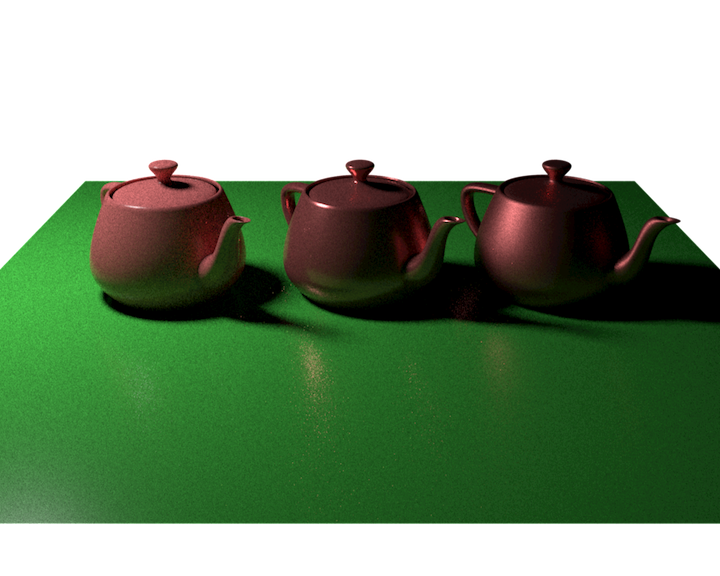

#Renderman RIS demos

## Directories
models -> demonstrates how the different shading models of the deafault Bxdf "PxrDisney" work
texturing -> how to generate texture using patterns

# Rule 1
Description for rule 1.

    

        <h2>Good</h2>
        <pre><code class="language-c">int foo (void) 
{
    int i;
}
</code></pre>
    

    

        <h2>Bad</h2>
        <pre><code class="language-c">int foo (void) {
    int i;
}
</code></pre>
    

