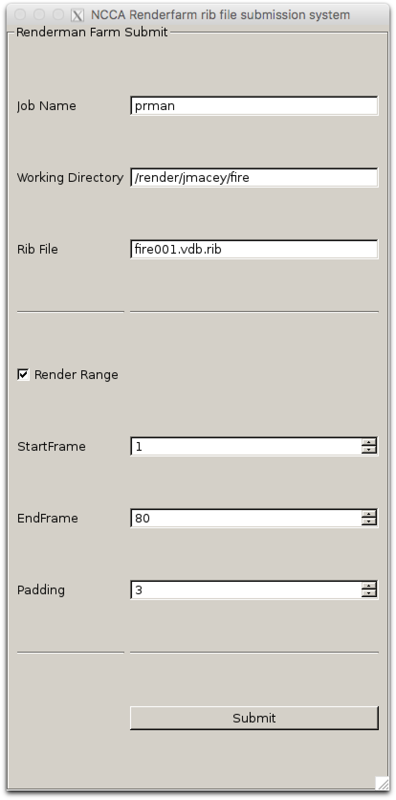

# NCCA Renderfarm submission GUI

This tool can be used to submit rib files to the renderfarm for rendering. There are two version and for the NCCA linux labs the version [submitPRMANtoFarmQt4.py](https://github.com/NCCA/Renderman/blob/master/renderfarm/submitPRMANtoFarmQt4.py) must be used, however there is a PyQT5 version as well.

## Pipeline

The first step is to copy all of the rib files, shaders, textures etc to the renderfarm directory.

In the following example I have a directory called **fire** which contains my project files. First we must create the directory on the remote drive in sftp else it will not work.

```
sftp tete.bournemouth.ac.uk
sftp> mkdir fire
sftp> put -r fire
```

This will now upload all the files to be rendered to tete the renderfarm server. On the server you have a directory called */render/[username]* so for example in the case above the renderfarm will have a directory called */render/jmacey/fire* for my account.

To open the GUI download the python file an execute
```
./submitPRMANtoFarmQt4.py
```



