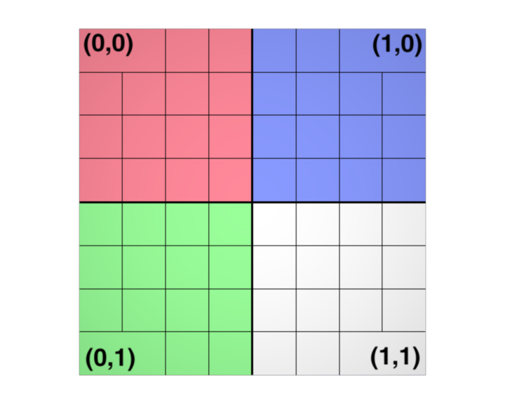

## Geometry in Renderman

#### using the python api

---

## Polygons
- The RenderMan Interface supports two basic types of polygons: 
  - a convex polygon and a general concave polygon with holes. 
- In both cases the polygon must be planar. 
- Collections of polygons can be passed by giving a list of points and an array that indexes these points. 
- The geometric normal of the polygon is computed by computing the normal of the plane containing the polygon (unless it is explicitly specified). 

--

## Normals

- If the current orientation is left-handed, then a polygon whose vertices were specified in clockwise order (from the point of view of the camera) will be a front-facing polygon (that is, will have a normal vector which points toward the camera) 
- If the current orientation is right-handed, then polygons whose vertices were specified in counter clockwise order will be front facing. 
- The shading normal is set to the geometric normal unless it is explicitly specified at the vertices.

--

## ri.Polygon

- Polygons are specified with the riPolygon function. 
- The parameter list must include at least position ("P") information. 

```
points=[-1,-1,0,0,1,0,1,-1,0]
normals=[0,0,-1,0,0,-1,0,0,-1]
tx=[0,1,0.5,0,1,1]
ri.Polygon({ri.P:points,ri.N:normals,ri.ST:tx})

Polygon "varying float[2] st" [0 1 0.5 0 1 1] "vertex point P" [-1 -1 -2 0 1 1 1 -1 0] "varying normal N" [0 0 -1 0 0 -1 0 0 -1]
```

--

## ri.GeneralPolygon


- Define a general planar concave polygon. 
- This polygon is specified by giving nloops lists of vertices. 
- Holes are no longer supported.

--

## ri.PointsPolygon

- Define npolys planar convex polygons that share vertices. 
- The array nvertices contains the number of vertices in each polygon and has length npolys. 
- The array vertices contains, for each polygon vertex, an index into the varying primitive variable arrays. 
- The varying arrays are 0-based. vertices has length equal to the sum of all of the values in the nvertices array.


--

## ri.PointsPolygon

```
points=[-0.5,-0.5,-0.5,
     0.5,-0.5,-0.5,
    -0.5, 0.5,-0.5,
     0.5, 0.5,-0.5,
    -0.5,-0.5, 0.5,
     0.5,-0.5, 0.5,
    -0.5, 0.5, 0.5,
     0.5, 0.5, 0.5]
npolys=[4,4,4,4,4,4]
nvertices=[0,2,3,1,0,1,5,4,0,4,6,2,1,3,7,5,2,6,7,3,4,5,7,6]
ri.PointsPolygons(npolys,nvertices,{ri.P:points})

```

--

## ri.PointsGeneralPolygons

- Define npolys general planar concave polygons, with holes, that share vertices. 
- The array nloops indicates the number of loops comprising each polygon and has a length npolys. 
- The array nvertices contains the number of vertices in each loop and has a length equal to the sum of all the values in the array nloops. 
- The array vertices contains, for each loop vertex, an index into the varying primitive variable arrays.

---

## ri.Points & ri.Curves

- The RenderMan Interface includes lightweight primitives for specifying point clouds, lines, curves, or ribbons. 
- These primitives are especially useful for representing many particles, hairs, etc.

--

## ri.Points

- Draws npoints number of point-like particles. 
- parameterlist is a list of token-array pairs where each token is one of the standard geometric primitive variables, a variable that has been defined with RiDeclare, or is given as an inline declaration. 
- The parameter list must include at least position ("P") information, one value for each particle. 

--

## ri.Points


- If a primitive variable is of class varying or vertex, the array contains npoints data values of the appropriate type, i.e., one per particle. 
- If the variable is uniform or constant, the array contains a single element. 

--

## [Points.py](https://github.com/NCCA/Renderman/blob/master/Lecture2Geo/Geometry/Points/Points.py)

```
#!/usr/bin/python
import prman

from random import uniform as ru

ri = prman.Ri() # create an instance of the RenderMan interface

filename = 'Points.rib'
# this is the begining of the rib archive generation we can only
# make RI calls after this function else we get a core dump
ri.Begin('__render')

ri.Option('searchpath', {'string shader': ['../../../Lecture1Intro/']})

# now we add the display element using the usual elements
# FILENAME DISPLAY Type Output format
ri.Display('Points.exr', 'it', 'rgba')
# Specify PAL resolution 1:1 pixel Aspect ratio
ri.Format(720,576,1)
# now set the projection to perspective
ri.Projection(ri.PERSPECTIVE,{ri.FOV:50}) 


# now we start our world
ri.WorldBegin()

ri.Translate(0,0,4)

ri.TransformBegin()

points=[]
width=[]
colour=[]
normals=[]
# get a pointer to the append method as it is faster than calling it
# each time
pappend=points.append
wappend=width.append
cappend=colour.append
nappend=normals.append
# ru is random.uniform brought in by the import statement above
for i in range(0,2000) :
	for ix in range(0,3) :
		cappend(ru(0,1))
		pappend(ru(-2,2))
		nappend(ru(0,1))	
	wappend(ru(0.01,0.2))
	
ri.Pattern( 'colour', 'colourShader')
ri.Bxdf( 'PxrDiffuse','bxdf', 
{
  'reference color diffuseColor' : ['colourShader:Cout']
})

ri.Points({ri.P:points,ri.CS:colour,ri.WIDTH:width,ri.N:normals})

ri.TransformEnd()
ri.WorldEnd()
# and finally end the rib file
ri.End()

```

--

## [Particle System](https://github.com/NCCA/Renderman/tree/master/Lecture2Geo/Geometry/Particle)


--

## [Maya Particles](https://github.com/NCCA/Renderman/blob/master/Lecture2Geo/Geometry/Particle/MayaParticleCache/MayaParticleCache.py)


```
dynExport -mnf 1 -mxf 500 -os 2 -atr position  -p "PDA" -f "ascii" particle1;
```


## ri.Curves
- Draws ncurves number of lines, curves, or ribbon-like particles of specified width through a set of control vertices. 
- Multiple disconnected individual curves may be specified using one call to RiCurves. 
- The parameter ncurves is the number of individual curves specified by this command
- nvertices is an array of length ncurves integers specifying the number of vertices in each of the respective curves.


--

## ri.Curves

- The interpolation method given by type can be either "linear" or "cubic". 
- Cubic curves interpolate using the v basis matrix and step size set by RiBasis. 
- The u parameter changes across the width of the curve, whereas the v parameter changes across the length of the curve (i.e., the direction specified by the control vertices). 

--

## ri.Curves

- Curves may wrap around in the v direction, depending on whether wrap is "periodic" or "nonperiodic". 
- Curves that wrap close upon themselves at the ends and the first control points will be automatically repeated. As many as three control points may be repeated, depending on the basis matrix of the curve. 


--

## [Curves.py](https://github.com/NCCA/Renderman/blob/master/Lecture2Geo/Geometry/Curves/Curves.py)
<div id="mySlideLeft">

</div>    

<div id="mySlideRight">

<pre><code data-trim data-noescape>
#!/usr/bin/python
import time,random
# import the python renderman library
import prman

from random import uniform as ru

ri = prman.Ri() # create an instance of the RenderMan interface
ri.Option('rib', {'string asciistyle': 'indented'})

filename = 'Curves.rib'
# this is the begining of the rib archive generation we can only
# make RI calls after this function else we get a core dump
ri.Begin('__render')

ri.Display('Curves.exr', 'it', 'rgba')
# Specify PAL resolution 1:1 pixel Aspect ratio
ri.Format(720,576,1)
# now set the projection to perspective
ri.Projection(ri.PERSPECTIVE,{ri.FOV:50}) 


# now we start our world
ri.WorldBegin()

ri.Translate(0,0,3)

ri.TransformBegin()
ri.Bxdf( 'PxrDiffuse','bxdf', 
{
  'color diffuseColor' : [1,0,0]
})
points= [0, 0, 0 ,-1, -.5 ,1 ,2 ,.5 ,1 ,1 ,0, -1 ]
width=[0.01,0.04]
ri.Curves( 'cubic',[4],'nonperiodic',{ri.P:points, ri.WIDTH : width})

ri.Bxdf( 'PxrDiffuse','bxdf', 
{
  'color diffuseColor' : [0,0,1]
})
points2=[0,0,0,3,4,5,-1,-.5,1,2,.5,1,1,0,-1]
ri.Curves('linear',[5],'nonperiodic',{ ri.P:points2 , ri.CONSTANTWIDTH:[0.075]})


ri.TransformEnd()
ri.WorldEnd()
# and finally end the rib file
ri.End()

</code></pre></div>

--


## [MultiCurve.py](https://github.com/NCCA/Renderman/blob/master/Lecture2Geo/Geometry/Curves/MultiCurve.py)

<div id="mySlideLeft">

</div>    

<div id="mySlideRight">

<pre><code data-trim data-noescape>
#!/usr/bin/python
# for bash we need to add the following to our .bashrc
# export PYTHONPATH=$PYTHONPATH:$RMANTREE/bin   
import time,random
# import the python renderman library
import prman

from random import uniform as ru


def buildField(wi,depth,inc,points,width,npoints) :
	xmin=-wi/2.0
	xmax=wi/2.0
	zmin=-depth/2.0
	zmax=depth/2.0
	pappend=points.append
	wappend=width.append
	npappend=npoints.append
	random.seed(1)
	ru=random.uniform
	zpos=zmin
	plus=0.1
	minus=-0.1
	while(zpos < zmax ) :
		xpos=xmin
		while (xpos < xmax) :
			pappend(xpos+ru(minus,plus))
			pappend(0) # z pos 1
			pappend(zpos+ru(minus,plus))
			
			pappend(xpos+ru(minus,plus))
			pappend(0.2) # z pos 2
			pappend(zpos+ru(minus,plus))
			
			pappend(xpos+ru(minus,plus))
			pappend(0.4) # z pos 3
			pappend(zpos+ru(minus,plus))
		
			pappend(xpos+ru(minus,plus))
			pappend(0.8+ru(-0.1,0.1)) # final z pos with random
			pappend(zpos+ru(minus,plus))
		
			wappend(0.006)
			wappend(0.003)
			npappend(4)
			xpos+=inc
		zpos+=inc
	


ri = prman.Ri() # create an instance of the RenderMan interface
ri.Option("rib", {"string asciistyle": "indented"})

points=[]
width=[]
npoints=[]
dir=0
dircount=0
#BuildField(1.5,0.1,0.01,points,width,npoints)
buildField(14,14,0.2,points,width,npoints)

filename = "__render" #"corn.%03d.rib" %(frame)
# this is the begining of the rib archive generation we can only
# make RI calls after this function else we get a core dump
ri.Begin(filename)
ri.ShadingRate(0.2)
# now we add the display element using the usual elements
# FILENAME DISPLAY Type Output format
ri.Display("MultiCurce" , "it", "rgba")
# Specify PAL resolution 1:1 pixel Aspect ratio
ri.Format(1024,720,1)
# now set the projection to perspective
ri.Projection(ri.PERSPECTIVE,{ri.FOV:40}) 
# now we start our world
ri.WorldBegin()
ri.Translate(0,0,10)
ri.Rotate(-20,1,0,0)

ri.TransformBegin()
ri.Curves( "cubic",npoints,"nonperiodic",{ri.P:points, ri.WIDTH : width})
ri.TransformEnd()
ri.WorldEnd()
# and finally end the rib file
ri.End()


</code></pre></div>


---

## Subdivision Surfaces

- Renderman supports SubDivision surfaces using the ```ri.SubdivisionMesh``` command
- More details can be found in [appnote 28](https://renderman.pixar.com/resources/RenderMan_20/appnote.28.html)
- Most of this work is also part of the [OpenSubDiv API](http://graphics.pixar.com/opensubdiv/docs/intro.html)


--

## [Subdiv.py](https://github.com/NCCA/Renderman/blob/master/Lecture2Geo/Geometry/Subdiv/Subdiv.py)

<div id="mySlideLeft">

</div>    

<div id="mySlideRight">

<pre><code data-trim data-noescape>
#!/usr/bin/python
# import the python renderman library
import prman


ri = prman.Ri() # create an instance of the RenderMan interface
ri.Option('rib', {'string asciistyle': 'indented'})

filename = 'PointPolygon.rib'
# this is the begining of the rib archive generation we can only
# make RI calls after this function else we get a core dump
ri.Begin('__render')
# now we add the display element using the usual elements
# FILENAME DISPLAY Type Output format
ri.Display('Subdiv.exr', 'it', 'rgba')
# Specify PAL resolution 1:1 pixel Aspect ratio
ri.Format(720,576,1)
# now set the projection to perspective
ri.Projection(ri.PERSPECTIVE,{ri.FOV:50}) 


# now we start our world
ri.WorldBegin()

ri.Translate(0,0,4)
ri.Rotate(-15,1,0,0)
ri.TransformBegin()

# create a simple checker pattern
expr="""
$colour = c1;
$c = floor( 10 * $u ) +floor( 10 * $v );
if( fmod( $c, 2.0 ) < 1.0 )
{
	$colour=c2;
}
$colour
"""
# all the indices are the same ammount
npolys=[4]*6
points=[-0.5, -0.5, -0.5, #0
				0.5, -0.5, -0.5, #1
				-0.5, 0.5, -0.5, #2
				0.5, 0.5, -0.5, #3
				-0.5, -0.5, 0.5, #4
				0.5, -0.5, 0.5, #5
				-0.5, 0.5, 0.5, #6
				0.5, 0.5, 0.5] #7
indices=[0, 1, 3, 2, #0
				 0, 4, 5, 1, #1
				 0, 2, 6, 4, #2
				 1, 5, 7, 3, #3
				 2, 3, 7, 6, #4
				 4, 6, 7, 5] #5

# use the pattern
ri.Pattern( 'PxrSeExpr' ,'seTexture',
{
	'color c1' : [1,1,1],
	'color c2' : [1,0,0],
	'string expression' : [ expr]
})
ri.Bxdf( 'PxrDiffuse','diffuse', 
{
#  'color diffuseColor'  : [1,0,0]
'reference color diffuseColor' : ['seTexture:resultRGB']
})

ri.TransformBegin()
ri.Translate(-1.5,0,0)
ri.Rotate(45,0,1,0)
ri.SubdivisionMesh("catmull-clark", 
										npolys, 
										indices, 
										[ri.CREASE, ri.CREASE, ri.CREASE, ri.CREASE], [5, 1, 5, 1, 5, 1, 5, 1], [4, 5, 7, 6, 4, 0, 1, 3, 2, 0, 0, 4, 6, 2, 0, 1, 5, 7, 3, 1], [3, 3, 3, 3], 
										{ri.P:points})

ri.TransformEnd()


# use the pattern
ri.Pattern( 'PxrSeExpr' ,'seTexture',
{
	'color c1' : [1,1,1],
	'color c2' : [0,0,0],
	'string expression' : [ expr]
})
ri.Bxdf( 'PxrDiffuse','diffuse', 
{
#  'color diffuseColor'  : [1,0,0]
'reference color diffuseColor' : ['seTexture:resultRGB']
})
ri.TransformBegin()
ri.Translate(0,0,0)
ri.Rotate(45,0,1,0)
ri.SubdivisionMesh("catmull-clark", 
										npolys, 
										indices, 
										[ri.CREASE, ri.CREASE, ri.CREASE, ri.CREASE], [5, 1, 5, 1, 5, 1, 5, 1], [4, 5, 7, 6, 4, 0, 1, 3, 2, 0, 0, 4, 6, 2, 0, 1, 5, 7, 3, 1], [1, 1, 1, 1], 
										{ri.P:points})

ri.TransformEnd()


# use the pattern
ri.Pattern( 'PxrSeExpr' ,'seTexture',
{
	'color c1' : [1,1,1],
	'color c2' : [0,0,1],
	'string expression' : [ expr]
})
ri.Bxdf( 'PxrDiffuse','diffuse', 
{
#  'color diffuseColor'  : [1,0,0]
'reference color diffuseColor' : ['seTexture:resultRGB']
})
ri.TransformBegin()
ri.Translate(1.5,0,0)
ri.Rotate(45,0,1,0)
ri.SubdivisionMesh('catmull-clark', 
										npolys, 
										indices, 
										[ri.CREASE, ri.CREASE, ri.CREASE, ri.CREASE], [5, 1, 5, 1, 5, 1, 5, 1], [4, 5, 7, 6, 4, 0, 1, 3, 2, 0, 0, 4, 6, 2, 0, 1, 5, 7, 3, 1], [10, 10, 10, 10], 
										{ri.P:points})

ri.TransformEnd()

ri.TransformEnd()
ri.WorldEnd()
# and finally end the rib file
ri.End()

</code></pre></div>


--

##[Sphere.py](https://github.com/NCCA/Renderman/blob/master/Lecture2Geo/Geometry/Subdiv/Sphere.py)

<div id="mySlideLeft">

</div>    

<div id="mySlideRight">

<pre><code data-trim data-noescape>
#!/usr/bin/python
# import the python renderman library
import prman


ri = prman.Ri() # create an instance of the RenderMan interface
ri.Option('rib', {'string asciistyle': 'indented'})

filename = 'Sphere.rib'
# this is the begining of the rib archive generation we can only
# make RI calls after this function else we get a core dump
ri.Begin('__render')
# now we add the display element using the usual elements
# FILENAME DISPLAY Type Output format
ri.Display('Sphere.exr', 'it', 'rgba')
# Specify PAL resolution 1:1 pixel Aspect ratio
ri.Format(720,576,1)
# now set the projection to perspective
ri.Projection(ri.PERSPECTIVE,{ri.FOV:50}) 


# now we start our world
ri.WorldBegin()

ri.Translate(0,0,4)
ri.Rotate(-15,1,0,0)
ri.TransformBegin()

# create a simple checker pattern
expr="""
$colour = c1;
$c = floor( 10 * $u ) +floor( 10 * $v );
if( fmod( $c, 2.0 ) < 1.0 )
{
	$colour=c2;
}
$colour
"""

# use the pattern
ri.Pattern( 'PxrSeExpr' ,'seTexture',
{
	'color c1' : [1,1,1],
	'color c2' : [1,0,0],
	'string expression' : [ expr]
})
ri.Bxdf( 'PxrDiffuse','diffuse', 
{
#  'color diffuseColor'  : [1,0,0]
'reference color diffuseColor' : ['seTexture:resultRGB']
})

s=1.5
points=[s,-s,-s,s,s,-s,s,-s,s,s,s,s,-s,s,s,-s,s,-s,-s,-s,s,-s,-s,-s]
ri.SubdivisionMesh('catmull-clark', 
										[4,4,4,4,4,4], 
										 [0,2,3,1,4,6,7,5,5,1,3,4,2,0,7,6,6,4,3,2,1,5,7,0], [],[],[],[],
									   {ri.P: points})

ri.TransformEnd()
ri.WorldEnd()
# and finally end the rib file
ri.End()

</code></pre>
</div>

--


## [Hull.py](https://github.com/NCCA/Renderman/blob/master/Lecture2Geo/Geometry/Subdiv/Hull.py)


<div id="mySlideLeft">

</div>    

<div id="mySlideRight">

<pre><code data-trim data-noescape>

#!/usr/bin/python
# import the python renderman library
import prman


ri = prman.Ri() # create an instance of the RenderMan interface
ri.Option('rib', {'string asciistyle': 'indented'})

filename = 'Hull.rib'
# this is the begining of the rib archive generation we can only
# make RI calls after this function else we get a core dump
ri.Begin('__render')
# now we add the display element using the usual elements
# FILENAME DISPLAY Type Output format
ri.Display('Hull.exr', 'it', 'rgba')
# Specify PAL resolution 1:1 pixel Aspect ratio
ri.Format(720,576,1)
# now set the projection to perspective
ri.Projection(ri.PERSPECTIVE,{ri.FOV:50}) 


# now we start our world
ri.WorldBegin()

ri.Translate(0,0,150)
ri.TransformBegin()

# create a simple checker pattern
expr="""
$colour = c1;
$c = floor( 10 * $u ) +floor( 10 * $v );
if( fmod( $c, 2.0 ) < 1.0 )
{
	$colour=c2;
}
$colour
"""

# use the pattern
ri.Pattern( 'PxrSeExpr' ,'seTexture',
{
	'color c1' : [1,1,1],
	'color c2' : [1,0,0],
	'string expression' : [ expr]
})
ri.Bxdf( 'PxrDiffuse','diffuse', 
{
#  'color diffuseColor'  : [1,0,0]
'reference color diffuseColor' : ['seTexture:resultRGB']
})


points=[-60,60,0,-60,20,0,-60,-20,0,-60,-60,0,-20,60,0,-20,20,45,-20,-20,45,-20,-60,0,20, 60,0,20,20,45,20,-20,45,20,-60,0,60,60,0,60,20,0,60,-20,0,60,-60,0]

ri.Rotate(45,1,0,0)
ri.Rotate(180,0,1,0)
ri.SubdivisionMesh('catmull-clark', 
										[4,4,4,4,4,4,4,4,4], 
										 [0,4,5,1,1,5,6,2,2,6,7,3,4,8,9,5,5,9,10,6,6,10,11,7,8,12,13,9,9,13, 14,10,10,14,15,11], [ri.INTERPBOUNDARY],[0,0],[],[],
									   {ri.P: points})

ri.TransformEnd()
ri.WorldEnd()
# and finally end the rib file
ri.End()

</code></pre></div>

--

##[HullHole.py](https://github.com/NCCA/Renderman/blob/master/Lecture2Geo/Geometry/Subdiv/HullHole.py)

<div id="mySlideLeft">

</div>    

<div id="mySlideRight">

<pre><code data-trim data-noescape>

#!/usr/bin/python
# import the python renderman library
import prman


ri = prman.Ri() # create an instance of the RenderMan interface
ri.Option('rib', {'string asciistyle': 'indented'})

filename = 'HullHole.rib'
# this is the begining of the rib archive generation we can only
# make RI calls after this function else we get a core dump
ri.Begin('__render') #filename)
# now we add the display element using the usual elements
# FILENAME DISPLAY Type Output format
ri.Display('HullHole.exr', 'it', 'rgba')
# Specify PAL resolution 1:1 pixel Aspect ratio
ri.Format(720,576,1)
# now set the projection to perspective
ri.Projection(ri.PERSPECTIVE,{ri.FOV:50}) 


# now we start our world
ri.WorldBegin()

ri.Translate(0,0,5)
ri.TransformBegin()

# create a simple checker pattern
expr="""
$colour = c1;
$c = floor( 10 * $u ) +floor( 10 * $v );
if( fmod( $c, 2.0 ) < 1.0 )
{
	$colour=c2;
}
$colour
"""

# use the pattern
ri.Pattern( 'PxrSeExpr' ,'seTexture',
{
	'color c1' : [1,1,1],
	'color c2' : [1,0,0],
	'string expression' : [ expr]
})
ri.Bxdf( 'PxrDiffuse','diffuse', 
{
#  'color diffuseColor'  : [1,0,0]
'reference color diffuseColor' : ['seTexture:resultRGB']
})

"""
points=[-2,-2,0,
				-2, 2,0,
				 2, 2,0,
				 2,-2,0,
				-1,-1,0,
				 0,1,0,
				 1,-1,0]

ri.Rotate(45,1,0,0)
ri.Rotate(180,0,1,0)
ri.SubdivisionMesh("catmull-clark", 
										[4,3], 
										 [0,1,2,3,4,5,6], [ri.HOLE],[0,0],[],[],
									   {ri.P: points})
"""
#ri.Rotate(25,1,0,0)
#ri.Rotate(180,0,1,0)

ri.HierarchicalSubdivisionMesh( "catmull-clark" ,[4, 4, 4 ,4 ,4 ,4 ,4 ,4 ,4], 
    [4 ,5 ,1 ,0 ,5 ,6 ,2 ,1 ,6 ,7 ,3, 2 ,8 ,9 ,5, 4 ,9 ,10, 6 ,5 ,10 ,11, 7 ,6 ,12 ,13 ,9, 8 ,13, 14, 10 ,9 ,14, 15, 11, 10] ,
    ["interpolateboundary" ,"faceedit", "vertexedit"] ,[1 ,0 ,0 ,4 ,0 ,1 ,20, 12 ,3], 
    [2 ,3, 4, 1, 1, 4, 4, 1, 1, 0, 4, 4, 1, 1, 1, 4, 4, 1, 1, 2, 4, 4, 1, 1, 3],
		 [0, 0, -1, 0, 0, -1, 0, 0, -1, 0, 0, -1], 
    ["hole", "add", "P", "value"], 
    {"P" : [-1, -1 ,0 ,-0.333333, -1, 0, 0.333333 ,-1 ,0 ,1 ,-1 ,0, 
		  -1, -0.333333, 0, -0.333333, -0.333333, 0, 0.333333, -0.333333, 0, 1, -0.333333, 0,
      -1 ,0.333333, 0, -0.333333, 0.333333, 0, 0.333333, 0.333333, 0, 1, 0.333333, 0,
      -1, 1, 0, -0.333333, 1, 0, 0.333333 ,1 ,0, 1, 1, 0]})


ri.TransformEnd()
ri.WorldEnd()
# and finally end the rib file
ri.End()

</code></pre></div>


--

[Crease.py](https://github.com/NCCA/Renderman/blob/master/Lecture2Geo/Geometry/Subdiv/Crease.py)

<div id="mySlideLeft">

</div>    

<div id="mySlideRight">

<pre><code data-trim data-noescape>

#!/usr/bin/python
# import the python renderman library
import prman


ri = prman.Ri() # create an instance of the RenderMan interface
ri.Option('rib', {'string asciistyle': 'indented'})

filename = 'Crease.rib'
# this is the begining of the rib archive generation we can only
# make RI calls after this function else we get a core dump
ri.Begin('__render')
# now we add the display element using the usual elements
# FILENAME DISPLAY Type Output format
ri.Display('Crease.exr', 'it', 'rgba')
# Specify PAL resolution 1:1 pixel Aspect ratio
ri.Format(720,576,1)
# now set the projection to perspective
ri.Projection(ri.PERSPECTIVE,{ri.FOV:50}) 


# now we start our world
ri.WorldBegin()

ri.Translate(0,0,4)
ri.TransformBegin()

# create a simple checker pattern
expr="""
$colour = c1;
$c = floor( 10 * $u ) +floor( 10 * $v );
if( fmod( $c, 2.0 ) < 1.0 )
{
	$colour=c2;
}
$colour
"""

# use the pattern
ri.Pattern( 'PxrSeExpr' ,'seTexture',
{
	'color c1' : [1,1,1],
	'color c2' : [1,0,0],
	'string expression' : [ expr]
})
ri.Bxdf( 'PxrDiffuse','diffuse', 
{
#  'color diffuseColor'  : [1,0,0]
'reference color diffuseColor' : ['seTexture:resultRGB']
})

s=1.0
points=[s,-s,-s,s,s,-s,s,-s,s,s,s,s,-s,s,s,-s,s,-s,-s,-s,s,-s,-s,-s]

ri.Rotate(45,1,1,0)

ri.SubdivisionMesh("catmull-clark", 
										[4,4,4,4,4,4], 
										 [0,2,3,1,4,6,7,5,5,1,3,4,2,0,7,6,6,4,3,2,1,5,7,0], [ri.CREASE,ri.CREASE],[5,1,5,1],[1, 5, 7, 0 ,1 ,3 ,4 ,6 ,2 ,3],[2,2],
									   {ri.P: points})

ri.TransformEnd()
ri.WorldEnd()
# and finally end the rib file
ri.End()
</code></pre></div>

--

[Cylinder.py](https://github.com/NCCA/Renderman/blob/master/Lecture2Geo/Geometry/Subdiv/Cylinder.py)

<div id="mySlideLeft">

</div>    

<div id="mySlideRight">

<pre><code data-trim data-noescape>

#!/usr/bin/python
# import the python renderman library
import prman


ri = prman.Ri() # create an instance of the RenderMan interface
ri.Option('rib', {'string asciistyle': 'indented'})

filename = 'Cylinder.rib'
# this is the begining of the rib archive generation we can only
# make RI calls after this function else we get a core dump
ri.Begin('__render')
# now we add the display element using the usual elements
# FILENAME DISPLAY Type Output format
ri.Display('Cylinder.exr', 'it', 'rgba')
# Specify PAL resolution 1:1 pixel Aspect ratio
ri.Format(720,576,1)
# now set the projection to perspective
ri.Projection(ri.PERSPECTIVE,{ri.FOV:50}) 


# now we start our world
ri.WorldBegin()

ri.Translate(0,0,4)
ri.TransformBegin()

# create a simple checker pattern
expr="""
$colour = c1;
$c = floor( 10 * $u ) +floor( 10 * $v );
if( fmod( $c, 2.0 ) < 1.0 )
{
	$colour=c2;
}
$colour
"""

# use the pattern
ri.Pattern( 'PxrSeExpr' ,'seTexture',
{
	'color c1' : [1,1,1],
	'color c2' : [1,0,0],
	'string expression' : [ expr]
})
ri.Bxdf( 'PxrDiffuse','diffuse', 
{
#  'color diffuseColor'  : [1,0,0]
'reference color diffuseColor' : ['seTexture:resultRGB']
})

s=1.0
points=[s,-s,-s,s,s,-s,s,-s,s,s,s,s,-s,s,s,-s,s,-s,-s,-s,s,-s,-s,-s]

ri.Rotate(45,1,1,0)

ri.SubdivisionMesh("catmull-clark", 
										[4,4,4,4,4,4], 
										 [0,2,3,1,4,6,7,5,5,1,3,4,2,0,7,6,6,4,3,2,1,5,7,0], [ri.CREASE,ri.CREASE],[5,1,5,1],[1, 5, 7, 0 ,1 ,3 ,4 ,6 ,2 ,3],[10,10],
									   {ri.P: points})

ri.TransformEnd()
ri.WorldEnd()
# and finally end the rib file
ri.End()

</code></pre></div>


---

## The Obj File format

- Alias Wavefront obj files define the geometry and other properties for objects which can be easily used within animation packages. 
- Object files can be in ASCII format .obj or binary format .mod. 
- For simplicity the ASCII format will be discussed here as it is easier to parse the data and is a good exercise for file and string handling. 
- In its current release, the .obj file format supports both polygonal objects and free-form objects such as curves, nurbs etc.

--

## File Format

- The following types of data may be included in an .obj file. In this list, the keyword (in parentheses) follows the data type.

  - geometric vertices (v)
  - texture vertices (vt)
  - vertex normals (vn)
  - face (f)

--

## File Format
- group name (g)
- smoothing group (s)
- material name (usemtl)
- material library (mtllib)
- all values are stored on a single line terminated with a \n (new line character)

--

## Face Format

- A valid vertex index matches the corresponding vertex elements of a previously defined vertex list.

```
f v1 v2 v3 ....
f v1/vt1 v2/vt2 v3/vt3 ...
f v1/vt1/vn1 v2/vt2/vn2 v3/vt3/vn3 ...
f v1//vn1 v2//vn2 v3//vn3 ...
```
- It is also possible to reference points using negative indices, where the indices are specified relative to the current maximum vertex position (-1 references the last vertex defined). 

--

## Face Format

- This makes it easy to describe the points in a face, then the face, without the need to store a large list of points and their indexes. In this way, "v" commands and "f" commands can be interspersed.

```
v -0.500000 0.000000 0.400000
v -0.500000 0.000000 -0.800000
v -0.500000 1.000000 -0.800000
v -0.500000 1.000000 0.400000
f -4 -3 -2 -1

```

---

## Python Obj Loader


- The python obj class is passed a file name and loads the obj file data into a number of lists
- These are then made available to a number of methods which produced renderman output for rendering


--

## [Obj.py](https://github.com/NCCA/Renderman/blob/master/common/Obj.py)

```
import prman


class Obj:
	
	# ctor to assign values
	def __init__(self, file):
		self.verts=[]
		self.norm=[]
		self.text=[]
		self.face=[]

		print 'opening : '+file
		# open the file
		ip = open(file,'r')
		#grab the data as lines
		data=ip.readlines()
		# for each line check for one of our tokens
		for line in data :
			# we assume that our Tokens are always the first element of the line (which IIRC the rispec specifies)
			# so we split each line and look at the first element
			tokens=line.split()	
			# make sure we have a token to check against
			if len(tokens) >0  :
				if tokens[0] =='v' :
					#print 'found vert'
					# create a tuple of the vertex point values
					vert=[float(tokens[1]),float(tokens[2]),float(tokens[3])]
					# then add it to our list
					self.verts+=[vert]
				elif tokens[0] =='vn' :
					#print 'found normal'
					# create a tuple of the normal values
					normal = [float(tokens[1]),float(tokens[2]),float(tokens[3])]
					# then add it to our list
					self.norm+=[normal]
				elif tokens[0] =='vt' :
					#print 'found texture'
					# create a tuple of the texture values
					#*****************************************************************
					tx=[float(tokens[1]),float(tokens[2])]
					#
					#*****************************************************************
					# then add it to our list
					self.text+=[tx]
				# now we have a face value
				elif(tokens[0] =='f') :
					# add the face to the list and we will process it later (see below)
					self.face+=[line]
				
		# close the file
		ip.close()
		
	def getExtents(self) :
		xmin=self.verts[min((n, i) for i, n in enumerate(self.verts))[1]][0]
		xmax=self.verts[max((n, i) for i, n in enumerate(self.verts))[1]][0]
		ymin=self.verts[min((n, i) for i, n in enumerate(self.verts))[1]][1]
		ymax=self.verts[max((n, i) for i, n in enumerate(self.verts))[1]][1]
		zmin=self.verts[min((n, i) for i, n in enumerate(self.verts))[1]][2]
		zmax=self.verts[max((n, i) for i, n in enumerate(self.verts))[1]][2]
		
		print xmin,xmax,ymin,ymax,zmin,zmax
	
		return xmin,xmax,ymin,ymax,zmin,zmax
		
		
	def Polygon(self,ri) :
		for f in self.face :
			# create some empty data structures to be filled as we go
			vertices=[]
			normals=[]
			points=[] 
			tx=[]
			fd=f.split() 
			# the face is in the structure shown below Vert / TX / Norm we are gaurenteed to have a
			# Vert but the others may not be there
			#1/1/1 3/2/2 4/3/3 2/4/4 
			for perface in fd[1:] :
				index=perface.split('/')
				if len(index) == 3 :
					# get the point array index
					pind=int(index[0])-1
					points.append(self.verts[pind][0])
					points.append(self.verts[pind][1])
					points.append(self.verts[pind][2])
					# check for textures and add if there
					if(index[1] !='') :
						tind=int(index[1])-1
						tx.append(self.text[tind][0])
						tx.append(self.text[tind][1])
					# check for normals and check they are there
					if(index[2] !='') :
						nind=int(index[2])-1
						normals.append(self.norm[nind][0])
						normals.append(self.norm[nind][1])
						normals.append(self.norm[nind][2])
				elif len(index) == 1 :
					# get the point array index
					pind=int(index[0])-1
					points.append(self.verts[pind][0])
					points.append(self.verts[pind][1])
					points.append(self.verts[pind][2])
				elif len(index) == 2 :
					# get the point array index
					pind=int(index[0])-1
					points.append(self.verts[pind][0])
					points.append(self.verts[pind][1])
					points.append(self.verts[pind][2])
					# check for textures and add if there
					if(index[1] !='') :
						tind=int(index[1])-1
						tx.append(self.text[tind][0])
						tx.append(self.text[tind][1])
				
								
			# create a dictionary to store the polygon data, we always have a point so we can add
			#this directly
			PolyData={ri.P:points}
			# now see if we have any texture co-ordinates and add them to the dictionary if we do
			if len(tx) !=0 :
				PolyData[ri.ST]=tx
			# check for normals and add them to the dictionary as well
			if len(normals) != 0 :
				PolyData[ri.N]=normals
			# finally we generate the Polygon from the data
			ri.Polygon(PolyData)  #{ri.P:points,ri.N:normals,ri.ST:tx})
			
			
	def PointsPolygon(self,ri) :
		npolys=[]
		vertices=[]
		normals=[]
		for f in self.face :
			# create some empty data structures to be filled as we go
			fd=f.split() 
			# the face is in the structure shown below Vert / TX / Norm we are gaurenteed to have a
			# Vert but the others may not be there
			#1/1/1 3/2/2 4/3/3 2/4/4 
			npolys.append(len(fd)-1)
			for perface in fd[1:] :
				index=perface.split('/')
				# get the point array index
				vertices.append(int(index[0])-1)
		v=[]
		# the verts are in a list of lists at the moment so we extract them
		# into a single list for prman
		for i in range(0,len(self.verts)) :
			for x in range(0,len(self.verts[i])) :
				v.append(self.verts[i][x])

		ri.PointsPolygons(npolys,vertices,{ri.P:v})
						
						
	def SubDivisionMesh(self,ri) :
		npolys=[]
		vertices=[]
		normals=[]
		for f in self.face :
			# create some empty data structures to be filled as we go
			fd=f.split() 
			# the face is in the structure shown below Vert / TX / Norm we are gaurenteed to have a
			# Vert but the others may not be there
			#1/1/1 3/2/2 4/3/3 2/4/4 
			npolys.append(len(fd)-1)
			for perface in fd[1:] :
				index=perface.split('/')
				# get the point array index
				vertices.append(int(index[0])-1)
		v=[]
		# the verts are in a list of lists at the moment so we extract them
		# into a single list for prman
		for i in range(0,len(self.verts)) :
			for x in range(0,len(self.verts[i])) :
				v.append(self.verts[i][x])

		#ri.PointsPolygons(npolys,vertices,{ri.P:v})
		ri.SubdivisionMesh('loop', npolys, vertices, [ri.CREASE], [2, 1], [3, 0], [20], {ri.P:v})
```


--

## [ObjTest.py](https://github.com/NCCA/Renderman/blob/master/Lecture2Geo/Obj2Rib/ObjTest.py)


--

## [ObjTest.py](https://github.com/NCCA/Renderman/blob/master/Lecture2Geo/Obj2Rib/ObjTest.py)

```
#!/usr/bin/python
# for bash we need to add the following to our .bashrc
# export PYTHONPATH=$PYTHONPATH:$RMANTREE/bin   
import prman
import sys
sys.path.append('../../common')
from Obj import *

objFile="troll.obj"

obj=Obj(objFile)


ri = prman.Ri() # create an instance of the RenderMan interface

ri.Option("rib", {"string asciistyle": "indented"})

for frame in range(0,360,10) :

	filename = "Obj2Rib.%03d.rib" %(frame)
	# this is the begining of the rib archive generation we can only
	# make RI calls after this function else we get a core dump
	ri.Begin(filename)
	# now we add the display element using the usual elements
	# FILENAME DISPLAY Type Output format
	ri.Display("Obj2Rib.%03d.exr" %(frame), "file", "rgba")
	# Specify PAL resolution 1:1 pixel Aspect ratio
	ri.Format(720,575,1)
	# now set the projection to perspective
	ri.Projection(ri.PERSPECTIVE,{ri.FOV:50}) 
	
	
	# now we start our world
	ri.WorldBegin()
	
	
	ri.Translate(0,0,2)
	ri.TransformBegin()
	
	ri.Translate(-1,0,0)
	ri.Rotate(frame,0,1,0)

	obj.Polygon(ri)
	ri.TransformEnd()
	
	
	ri.TransformBegin()
	ri.Rotate(frame,0,1,0)

	obj.PointsPolygon(ri)
	ri.TransformEnd()
	
	
	
	ri.TransformBegin()
	ri.Translate(1,0,0)
	ri.Rotate(frame,0,1,0)

	obj.SubDivisionMesh(ri)
	ri.TransformEnd()
	
	ri.WorldEnd()
	# and finally end the rib file
	ri.End()
```

---

## Procedural Primitives

- Procedural primitives allow use to call a helper program which generates geometry on-the-fly in response to procedural primitive requests in the RIB stream. 
- Each generated procedural primitive is described by a request to the helper program, in the form of an ASCII datablock which describes the primitive to be generated. 


--

## Procedural Primitives

- This datablock can be anything which is meaningful and adequate to the helper program, such as a sequence of a few floating point numbers, a filename, or a snippet of code in a interpreted modeling language. 
- In addition the renderer supplies the detail of the primitive's bounding box, so that the generating program can make decisions on what to generate based on how large the object will appear on-screen.

--

## Procedural Primitives

- The generation program reads requests on its standard input stream, and emits RIB streams on its standard output stream. 
- These RIB streams are read into the renderer as though they were read from a file (as with ReadArchive ), and may include any standard RenderMan attributes and primitives (including procedural primitive calls to itself or other helper programs). 

--

## Procedural Primitives

- As long as any procedural primitives exist in the rendering database which require the identical helper program for processing, the socket connection to the program will remain open. 
- This means that the program should be written with a loop which accepts any number of requests and generates a RIB "snippet" for each one.

--

## Procedural Primitives

- The specific syntax of the request from the renderer to the helper program is extremely simple, as follows:

```
fprintf(socket, "%g %s\n", detail, datablock);
```
- The detail is provided first, as a single floating-point number, followed by a space, followed by the datablock and finally a newline.

- The datablock is completely uninterpreted by the renderer or by the socket write, so any newlines or special characters should be preserved 

--

## Procedural Primitives
- The helper program's response should be to create a RIB file on stdout, 
```
RiBegin(RI_NULL);
   RiAttributeBegin();
     // various attributes
     // various primitives
   RiAttributeEnd();
 RiArchiveRecord(RI_COMMENT,"\377");
RiEnd();
```

--

## Procedural Primitives
- Notice, in particular, the special trick which the helper program must use to stay in synchronized communication with the renderer.
- stdout should not be closed when the RIB snippet is complete, but rather a single '\377' character should be emitted and the stdout stream flushed. 
- This will signal the renderer that this particular snippet is complete, yet leave the stream open in order to write the next snippet. 

--

## Procedural Primitives

- The use of RiArchiveRecord and RiEnd as above will accomplish this when the RIB client library is used.
- Warning: if the '\377' character is not emitted, nor is accidentally not flushed through the stdout pipe to the renderer, the render will hang.
- When the renderer is done with the helper program, it will close its end of the IPC socket, so reading an EOF on stdin is the signal for the helper program to exit.

--

## Procedural Primitives

- @size[smaller](In RIB, the syntax for specifying a RIB-generating program procedural primitive is:)

```
Procedural "RunProgram" [ "program" "datablock" ] [ bound ]
```
- program is the name of the helper program to execute, and may include command line options. 
- datablock is the generation request data block. It is an ASCII string which is meaningful to program, and adequately describes the children which are to be generated. 
- The bound is an array of six floating point numbers which is xmin, xmax, ymin, ymax, zmin, zmax in the current object space.


---

## references
- Renderman documentation
- Using Procedural Primitives in PhotoRealistic RenderMan
- PRMan for Python — A Bridge from PRMan to Python and Back
- http://www.fileformat.info/format/wavefrontobj/
- App not #19 Using the RiCurves Primitive
- http://docs.python.org/
- Appendix D - RenderMan Interface Bytestream Conventions
- Application Note #3 How To Render Quickly Using PhotoRealistic RenderMan