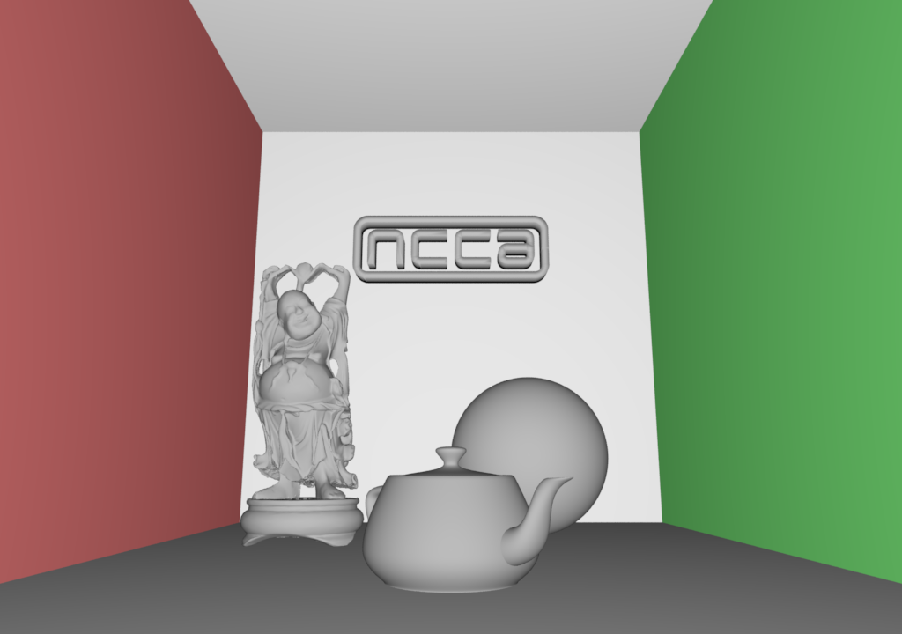
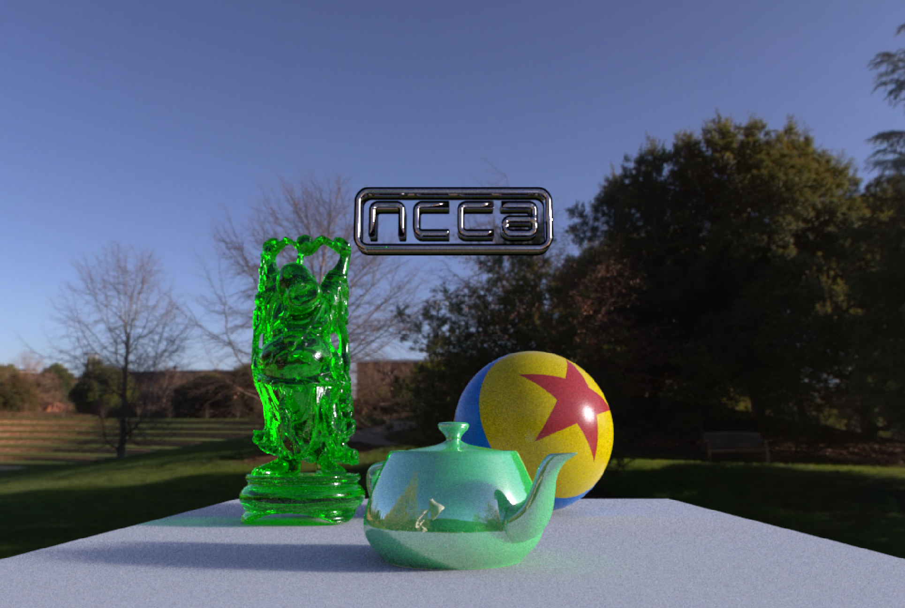
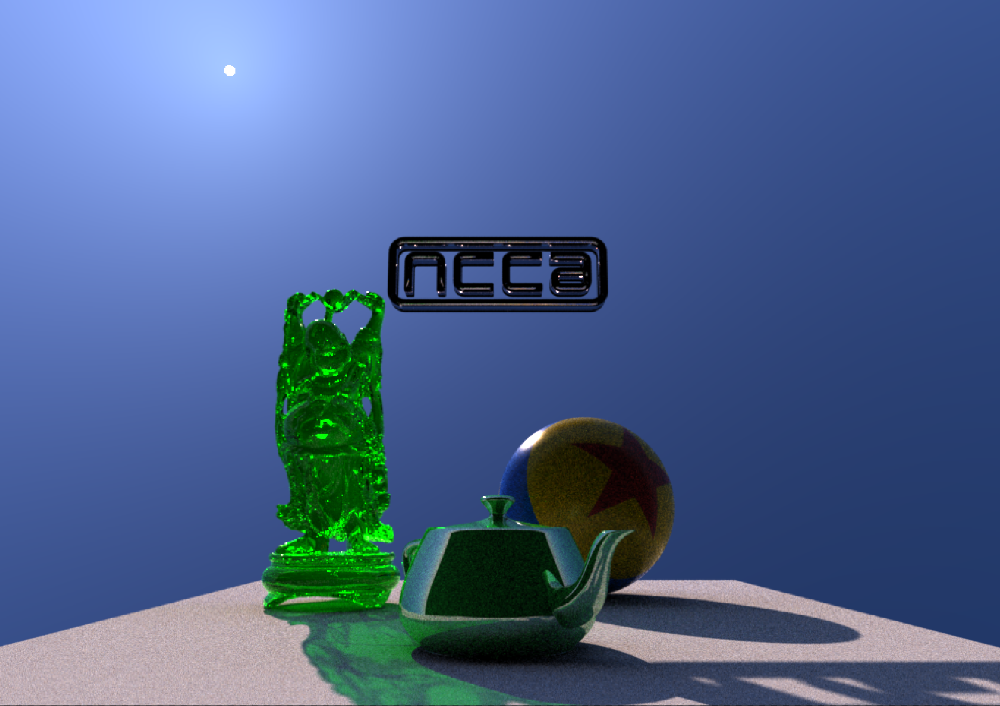
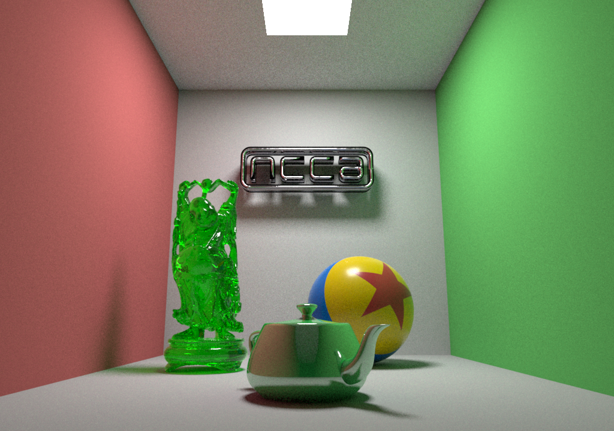
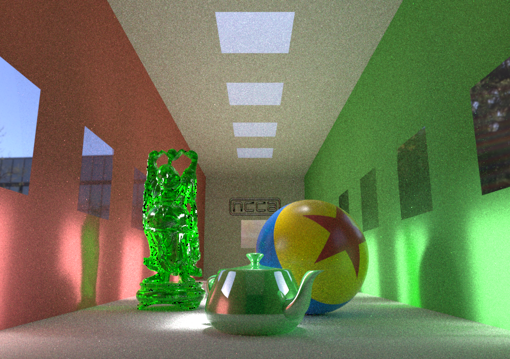
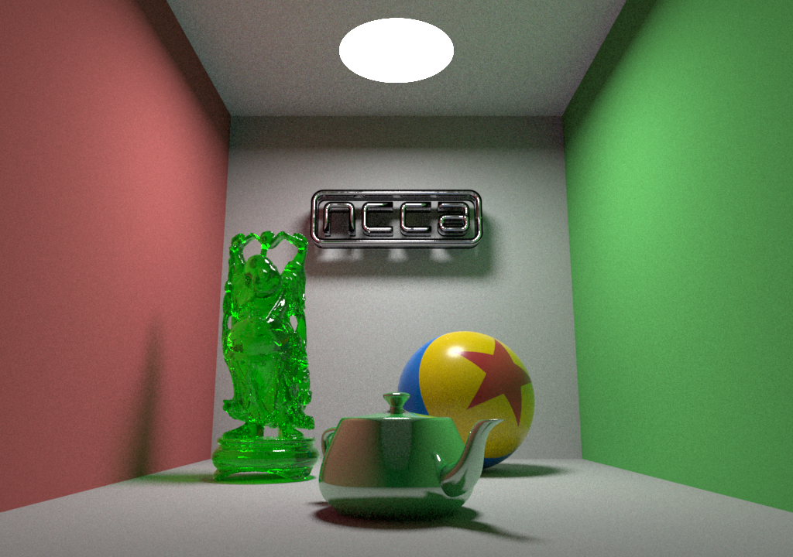
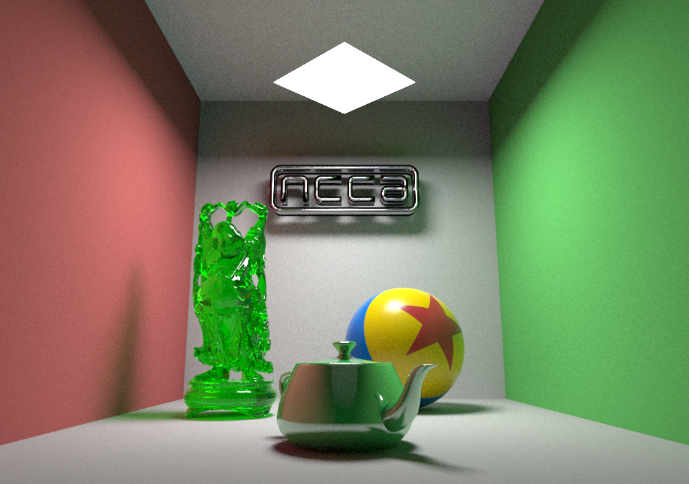
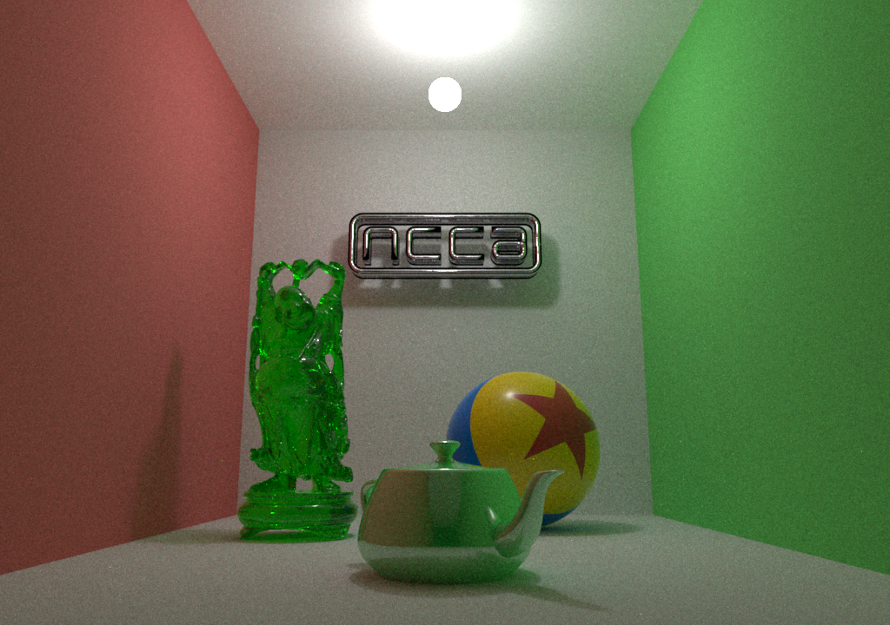
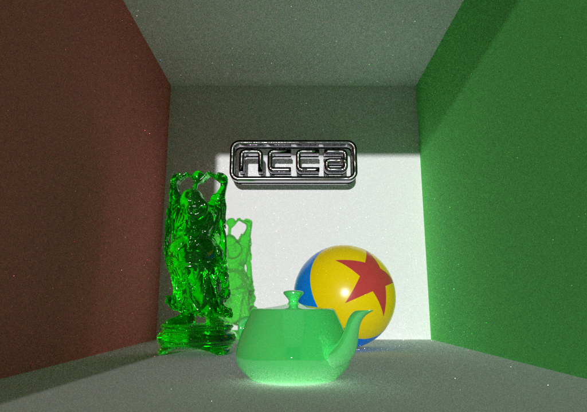
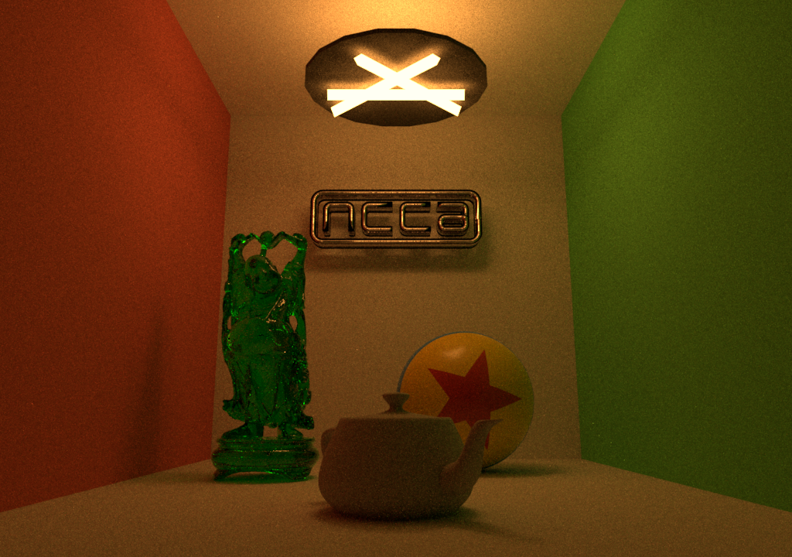

## Lighting in Renderman

#### using the python api

---

## Renderman Light Models

- Lighting in renderman is designed to be simple and flexible
- Most lights are based on simple geometric shapes such as
  - DomeLight, DistantLight, RectLight and SphereLight
- arbitrary geometry may also have a light Bxdf attached to create more complex lighting 

--

## [Lighting A Scene](https://rmanwiki.pixar.com/display/REN22/Lighting)

- There are 3 ways to light a scene
  - Analytic Lights 
  - Mesh Lights 
  - Emissive Surfaces

--

## Analytic Lights

-  These are the preferred choice. 
- These provide superior memory usage, flexibility, and speed. 
- Their visibility is a simple on and off for camera visibility.
- PxrDomeLight - The domelight acts as the environment light for a scene and is often mapped with a high dymanic range image (HDRI).
  - ```PxrRectLight PxrDistantLight PxrDiskLight PxrSphereLight PxrEnvDaylight PxrPortalLight```

--

## Mesh Lights 

- These are great for using arbitrary shapes in lighting. 
- These consume more memory since they are geometry and complex shapes may increase noise. 
- These can make use of visibility like any other object: camera, shadow/transmission, and indirect visibility.
  - ```PxrMeshLight ```

--

## Emissive Surfaces 
 - These typically use a constant bxdf or "glow" parameter to light a scene indirectly. 
 - This is inefficient and should usually be avoided but may be useful for texture mapping "lights" onto futuristic objects and panels!


---

## Materials

- Materials in RenderMan are often referred to as Bxdfs 
- A Bxdf describes the material to the integrator that determines the final rendered look. 
- Combined with the [integrator](https://rmanwiki.pixar.com/display/REN/Integrators) (PxrPathTracer,PxrVCM and soon PxrUnified) and lights this is used to describe the basic surface response to lights in the scene. 
- It is also possible to write custom Integrators and Bxdf using the c++ API.

--

## [Integrators](https://rmanwiki.pixar.com/display/REN/Integrators)

- Integrators take the camera rays and return results to the renderer. 
- For the main renderman integrators these are estimates of the light energy ([radiance](https://en.wikipedia.org/wiki/Radiance)) from the surfaces seen from the outside along the rays. 
- These main integrators are responsible for computing the overall light transport, that is, light that travels from a light source through your scene from object to object (or through objects and volumes) to reach the camera. 
- For more details see [Rendering Equation](https://en.wikipedia.org/wiki/Rendering_equation)

--

## Renderman Integrators

- [PxrPathTracer](https://rmanwiki.pixar.com/display/REN/PxrPathTracer) implements a unidirectional path tracer.
- [PxrVCM](https://rmanwiki.pixar.com/display/REN/PxrVCM) extends PxrPathTracer with bidirectional path tracing. 
- [PxrUnified](https://rmanwiki.pixar.com/display/REN22/PxrUnified) PxrUnified is the integrator Pixar relies on for its own film and animated shorts. It implements both the forward path tracing algorithm and bidirectional choices along with faster caustics using the Manifold Next Event Estimation technique here called Manifold Walk. 

--

## [PxrPathTracer](https://rmanwiki.pixar.com/display/REN/PxrPathTracer)

- PxrPathTracer implements the [forward path tracing algorithm](http://www.graphics.stanford.edu/courses/cs348b-01/course29.hanrahan.pdf), which excels in outdoor, highly specular scenes. 
- The simplicity of the algorithm generally makes it easy to use and to implement. - Shortcomings may include slow convergence speeds, especially for scenes with significant caustic illumination.

--

## [PxrVCM](https://rmanwiki.pixar.com/display/REN/PxrVCM)

- PxrVCM combines bidirectional path tracing with progressive photon mapping (also known as vertex merging). 
- Each of these techniques brings the ability to capture a certain range of light transport paths more efficiently than a pure forward path tracing algorithm
- [Light Transport Simulation with Vertex Connection and Merging](https://cgg.mff.cuni.cz/~jaroslav/papers/2012-vcm/2012-vcm-paper.pdf) 
- [A Path Space Extension for Robust Light Transport Simulation](http://cs.au.dk/~toshiya/ups.pdf). 


--

### Debug and Non-photorealistic Integrators

- renderman provides a number of integrators to aid debugging or to generate non-photorealistic effects (occlusion)
- [PxrOcclusion](https://rmanwiki.pixar.com/display/REN22/PxrOcclusion) is a non-photorealistic integrator that can be used to render ambient occlusion, among other effects.
- [PxrDirectLighting](https://rmanwiki.pixar.com/display/REN22/PxrDirectLighting) This is a quick "draft" quality integrator, useful for scene setup and debug.
- [PxrDefault](https://rmanwiki.pixar.com/display/REN22/PxrDefault) Even simpler than PxrDirectLighting, the default integrator places a virtual light at the camera (the "headlamp integrator").

--

### Debug and Non-photorealistic Integrators

- [PxrDebugShadingContext](https://rmanwiki.pixar.com/display/REN22/PxrDebugShadingContext) This integrator is used to visualize data in the shading context, such as normals and texture coordinates. 
- [PxrVisualizer](https://rmanwiki.pixar.com/display/REN22/PxrVisualizer)  PxrVisualizer is a utility integrator that can be used to navigate large scenes and inspect geometry.
- It can be used to see wireframe, ST, normal, flat and bxdf + wireframe shading 


---

## Renderman Materials

- Renderman ships with a number of material, these describe how the surface of an object or medium (volume) is affected by the lights in the scene.
- These materials are usually combined with patterns and image based texture maps to generate more complex looks
- Materials may also be layered to generate more complex surfaces, as well as add displacements of various types.
- for now we will concentrate on simple models before looking at pattern generation and displacement.

--

## PxrBlack

- does not scatter/reflect light

<div id="mySlideLeft">
<H4 align="center">Rib</H4>
<pre><code data-trim data-noescape>
Bxdf "PxrBlack" "id" 
</code></pre></div>

<div id="mySlideRight">
<H4 align="center">Python</H4>
<pre><code data-trim data-noescape>
ri.Bxdf('PxrBlack','id',
{
})
</code></pre></div>

--

## PxrConstant

<div id="mySlideLeft">
<H4 align="center">Rib</H4>
<pre><code data-trim data-noescape>
Bxdf "PxrConstant" "id" 
	"color emitColor"  [1. 1. 1.] 
	"float presence"  [1] 
</code></pre></div>

<div id="mySlideRight">
<H4 align="center">Python</H4>
<pre><code data-trim data-noescape>
ri.Bxdf('PxrConstant','id',
{
	'color emitColor' : [1.,1.,1.], 
	'float presence' : [1], 
})
</code></pre></div>


--

## [PxrSurface](https://rmanwiki.pixar.com/display/REN22/PxrSurface)

- Rendering surfaces in RenderMan relies on a layerable material called PxrSurface. 
  - can do Wood, Skin, Plastic, Glass, Car Paint (and more!)
- This is the same material model used in Pixar Animation Studios' feature animation. 
- The material is created by setting different [lobes](https://disney-animation.s3.amazonaws.com/library/s2012_pbs_disney_brdf_notes_v2.pdf)
- It's by combining these lobe settings that you can make just about any material you imagine.

--

## [PxrSurface](https://rmanwiki.pixar.com/display/REN22/PxrSurface)

<div id="mySlideLeft">
<H4 align="center">Rib</H4>
<pre><code data-trim data-noescape>
Bxdf "PxrSurface" "id" 
	"float inputMaterial"  ['No Value'] 
	"int utilityPattern"  [0] 
	"float diffuseGain"  [1.0] 
	"color diffuseColor"  [0.18 0.18 0.18] 
	"float diffuseRoughness"  [0.0] 
	"int specularFresnelMode"  [0] 
	"color specularFaceColor"  [0 0 0] 
	"color specularEdgeColor"  [0 0 0] 
	"float specularFresnelShape"  [5.0] 
	"color specularIor"  [1.5 1.5 1.5] 
	"color specularExtinctionCoeff"  [0.0 0.0 0.0] 
	"float specularRoughness"  [0.2] 
	"int roughSpecularFresnelMode"  [0] 
	"color roughSpecularFaceColor"  [0 0 0] 
	"color roughSpecularEdgeColor"  [0 0 0] 
	"float roughSpecularFresnelShape"  [5.0] 
	"color roughSpecularIor"  [1.5 1.5 1.5] 
	"color roughSpecularExtinctionCoeff"  [0.0 0.0 0.0] 
	"float roughSpecularRoughness"  [0.6] 
	"int clearcoatFresnelMode"  [0] 
	"color clearcoatFaceColor"  [0 0 0] 
	"color clearcoatEdgeColor"  [0 0 0] 
	"float clearcoatFresnelShape"  [5.0] 
	"color clearcoatIor"  [1.5 1.5 1.5] 
	"color clearcoatExtinctionCoeff"  [0.0 0.0 0.0] 
	"float clearcoatThickness"  [0.0] 
	"color clearcoatAbsorptionTint"  [0.0 0.0 0.0] 
	"float clearcoatRoughness"  [0.0] 
	"float specularEnergyCompensation"  [0.0] 
	"float clearcoatEnergyCompensation"  [0.0] 
	"float iridescenceFaceGain"  [0] 
	"float iridescenceEdgeGain"  [0] 
	"float iridescenceFresnelShape"  [5.0] 
	"int iridescenceMode"  [0] 
	"color iridescencePrimaryColor"  [1 0 0] 
	"color iridescenceSecondaryColor"  [0 0 1] 
	"float iridescenceRoughness"  [0.2] 
	"float fuzzGain"  [0.0] 
	"color fuzzColor"  [1 1 1] 
	"float fuzzConeAngle"  [8] 
	"int subsurfaceType"  [0] 
	"float subsurfaceGain"  [0.0] 
	"color subsurfaceColor"  [0.830 0.791 0.753] 
	"float subsurfaceDmfp"  [10] 
	"color subsurfaceDmfpColor"  [0.851 0.557 0.395] 
	"float shortSubsurfaceGain"  [0.0] 
	"color shortSubsurfaceColor"  [0.9 0.9 0.9] 
	"float shortSubsurfaceDmfp"  [5] 
	"float longSubsurfaceGain"  [0.0] 
	"color longSubsurfaceColor"  [0.8 0.0 0.0] 
	"float longSubsurfaceDmfp"  [20] 
	"float subsurfaceDirectionality"  [0.0] 
	"float subsurfaceBleed"  [0.0] 
	"float subsurfaceDiffuseBlend"  [0.0] 
	"int subsurfaceResolveSelfIntersections"  [0] 
	"float subsurfaceIor"  [1.4] 
	"float singlescatterGain"  [0.0] 
	"color singlescatterColor"  [0.830 0.791 0.753] 
	"float singlescatterMfp"  [10] 
	"color singlescatterMfpColor"  [0.851 0.557 0.395] 
	"color irradianceTint"  [1.0 1.0 1.0] 
	"float irradianceRoughness"  [0.0] 
	"float unitLength"  [0.1] 
	"float refractionGain"  [0.0] 
	"float reflectionGain"  [0.0] 
	"color refractionColor"  [1 1 1] 
	"float glassRoughness"  [0.1] 
	"float glowGain"  [0.0] 
	"color glowColor"  [1 1 1] 
	"normal bumpNormal"  [0 0 0] 
	"color shadowColor"  [0.0 0.0 0.0] 
	"int shadowMode"  [0] 
	"float presence"  [1] 
	"int presenceCached"  [1] 
	"int mwStartable"  [0] 
	"float roughnessMollificationClamp"  [32] 
</code></pre></div>

<div id="mySlideRight">
<H4 align="center">Python</H4>

<pre><code data-trim data-noescape>
ri.Bxdf('PxrSurface','id',
{
	'float inputMaterial' : ['No Value'], 
	'int utilityPattern' : [0], 
	'float diffuseGain' : [1.0], 
	'color diffuseColor' : [0.18,0.18,0.18], 
	'float diffuseRoughness' : [0.0], 
	'int specularFresnelMode' : [0], 
	'color specularFaceColor' : [0,0,0], 
	'color specularEdgeColor' : [0,0,0], 
	'float specularFresnelShape' : [5.0], 
	'color specularIor' : [1.5,1.5,1.5], 
	'color specularExtinctionCoeff' : [0.0,0.0,0.0], 
	'float specularRoughness' : [0.2], 
	'int roughSpecularFresnelMode' : [0], 
	'color roughSpecularFaceColor' : [0,0,0], 
	'color roughSpecularEdgeColor' : [0,0,0], 
	'float roughSpecularFresnelShape' : [5.0], 
	'color roughSpecularIor' : [1.5,1.5,1.5], 
	'color roughSpecularExtinctionCoeff' : [0.0,0.0,0.0], 
	'float roughSpecularRoughness' : [0.6], 
	'int clearcoatFresnelMode' : [0], 
	'color clearcoatFaceColor' : [0,0,0], 
	'color clearcoatEdgeColor' : [0,0,0], 
	'float clearcoatFresnelShape' : [5.0], 
	'color clearcoatIor' : [1.5,1.5,1.5], 
	'color clearcoatExtinctionCoeff' : [0.0,0.0,0.0], 
	'float clearcoatThickness' : [0.0], 
	'color clearcoatAbsorptionTint' : [0.0,0.0,0.0], 
	'float clearcoatRoughness' : [0.0], 
	'float specularEnergyCompensation' : [0.0], 
	'float clearcoatEnergyCompensation' : [0.0], 
	'float iridescenceFaceGain' : [0], 
	'float iridescenceEdgeGain' : [0], 
	'float iridescenceFresnelShape' : [5.0], 
	'int iridescenceMode' : [0], 
	'color iridescencePrimaryColor' : [1,0,0], 
	'color iridescenceSecondaryColor' : [0,0,1], 
	'float iridescenceRoughness' : [0.2], 
	'float fuzzGain' : [0.0], 
	'color fuzzColor' : [1,1,1], 
	'float fuzzConeAngle' : [8], 
	'int subsurfaceType' : [0], 
	'float subsurfaceGain' : [0.0], 
	'color subsurfaceColor' : [0.830,0.791,0.753], 
	'float subsurfaceDmfp' : [10], 
	'color subsurfaceDmfpColor' : [0.851,0.557,0.395], 
	'float shortSubsurfaceGain' : [0.0], 
	'color shortSubsurfaceColor' : [0.9,0.9,0.9], 
	'float shortSubsurfaceDmfp' : [5], 
	'float longSubsurfaceGain' : [0.0], 
	'color longSubsurfaceColor' : [0.8,0.0,0.0], 
	'float longSubsurfaceDmfp' : [20], 
	'float subsurfaceDirectionality' : [0.0], 
	'float subsurfaceBleed' : [0.0], 
	'float subsurfaceDiffuseBlend' : [0.0], 
	'int subsurfaceResolveSelfIntersections' : [0], 
	'float subsurfaceIor' : [1.4], 
	'float singlescatterGain' : [0.0], 
	'color singlescatterColor' : [0.830,0.791,0.753], 
	'float singlescatterMfp' : [10], 
	'color singlescatterMfpColor' : [0.851,0.557,0.395], 
	'color irradianceTint' : [1.0,1.0,1.0], 
	'float irradianceRoughness' : [0.0], 
	'float unitLength' : [0.1], 
	'float refractionGain' : [0.0], 
	'float reflectionGain' : [0.0], 
	'color refractionColor' : [1,1,1], 
	'float glassRoughness' : [0.1], 
	'float glowGain' : [0.0], 
	'color glowColor' : [1,1,1], 
	'normal bumpNormal' : [0,0,0], 
	'color shadowColor' : [0.0,0.0,0.0], 
	'int shadowMode' : [0], 
	'float presence' : [1], 
	'int presenceCached' : [1], 
	'int mwStartable' : [0], 
	'float roughnessMollificationClamp' : [32], 
})
</code></pre></div>

--

## [PxrDisney](https://renderman.pixar.com/resources/RenderMan_20/PxrDisney.html)

- The PxrDisney shader is a "catch-all" shader, designed to be flexible and dynamic in a production shading pipeline. 
- The shader is based on the [Disney "principled" BRDF by Brent Burley](https://disney-animation.s3.amazonaws.com/library/s2012_pbs_disney_brdf_notes_v2.pdf)
- This shader is still included with Renderman 22.x also with source code as a .cpp file. 
- However documentation and use seems to be reduced in favour of PxrSurface in newer versions of Renderman.
- Is simpler to use than PxrSurface as it has less parameters to tweak!

--

## PxrDisney

<div id="mySlideLeft">
<H4 align="center">Rib</H4>
<pre><code data-trim data-noescape>
Bxdf "PxrDisney" "id" 
	"color baseColor"  [.2 .5 .8] 
	"color emitColor"  [0 0 0] 
	"float subsurface"  [0] 
	"color subsurfaceColor"  [0 0 0] 
	"float metallic"  [0] 
	"float specular"  [.5] 
	"float specularTint"  [0] 
	"float roughness"  [.25] 
	"float anisotropic"  [0] 
	"float sheen"  [0] 
	"float sheenTint"  [.5] 
	"float clearcoat"  [0] 
	"float clearcoatGloss"  [1] 
	"normal bumpNormal"  [0 0 0] 
	"float presence"  [1] 
	"int inputAOV"  [0] 
</code></pre></div>

<div id="mySlideRight">
<H4 align="center">Python</H4>

<pre><code data-trim data-noescape>
ri.Bxdf('PxrDisney','id',
{
	'color baseColor' : [.2,.5,.8], 
	'color emitColor' : [0,0,0], 
	'float subsurface' : [0], 
	'color subsurfaceColor' : [0,0,0], 
	'float metallic' : [0], 
	'float specular' : [.5], 
	'float specularTint' : [0], 
	'float roughness' : [.25], 
	'float anisotropic' : [0], 
	'float sheen' : [0], 
	'float sheenTint' : [.5], 
	'float clearcoat' : [0], 
	'float clearcoatGloss' : [1], 
	'normal bumpNormal' : [0,0,0], 
	'float presence' : [1], 
	'int inputAOV' : [0], 
})
</code></pre></div>

--

## Other Materials

- [PxrLayerSurface](https://rmanwiki.pixar.com/display/REN22/PxrLayerSurface) is designed for layering materials. 
- [PxrVolume](https://rmanwiki.pixar.com/display/REN22/PxrVolume) A powerful and fast volumetric shader used for smoke, fire, explosions, and more. 
- [PxrMarschnerHair](https://rmanwiki.pixar.com/display/REN22/PxrMarschnerHair)  This material is designed for hair, fur, and fibers.
- We will investigate these in a later lecture.

---

## Basic Scene

<div id="mySlideLeft">

</div>

<div id="mySlideRight">

<p/> - most of the following examples will use this basic scene
<p/> - a diffuse [Cornell Box](https://en.wikipedia.org/wiki/Cornell_box)
<p/> - a metalic [Utah Teapot](https://en.wikipedia.org/wiki/Utah_teapot)
<p/> - a glass [Stanford Buddah](http://graphics.stanford.edu/data/3Dscanrep/)
<p/> - a [Luxo Ball](https://www.digitalspy.com/movies/a773975/a-brief-history-of-the-luxo-ball-in-pixar-movies-from-toy-story-to-inside-out/)
</div>

--

## [cornell.rib](https://github.com/NCCA/Renderman/blob/master/Lecture3Lighting/assets/cornell.rib)

```
# simple rib file for the walls of the cornell box
  AttributeBegin
    Bxdf "PxrDiffuse" "left" "color diffuseColor" [0.8 0.2 0.2]
    Polygon "P" [-1 1 -5  -1 1 1  -1 -1 1  -1 -1 -5]
    Bxdf "PxrDiffuse" "right" "color diffuseColor" [0.2 0.8 0.2]
    Polygon "P" [1 -1 -5  1 -1 1  1 1 1  1 1 -5]
    Bxdf "PxrDiffuse" "floor" "color diffuseColor" [0.8 0.8 0.8]
    Polygon "P" [-1 -1 1  1 -1 1  1 -1 -5  -1 -1 -5]
    Bxdf "PxrDiffuse" "ceiling" "color diffuseColor" [0.95 0.95 0.95]
    Polygon "P" [-1 1 -5  1 1 -5  1 1 1  -1 1 1]
    Bxdf "PxrDiffuse" "back" "color diffuseColor" [0.8 0.8 0.8]
    Polygon "P" [-1 1 1  1 1 1  1 -1 1  -1 -1 1]
  AttributeEnd
```

--

## Basic Scene

- In the main demos the scene is the same with a number of materials and shaders used to add visual interest.
- For exterior lighting demos the cornell box will be ommited

```
  ri.AttributeBegin()
  ri.Attribute( 'identifier',{ 'name' :'cornell'})
  ri.ReadArchive('cornell.rib')
  ri.AttributeEnd()

  ri.AttributeBegin()
  ri.Attribute( 'identifier',{ 'name' :'buddha'})
  ri.TransformBegin()
  ri.Translate(-0.5,-1,0)
  ri.Rotate(180,0,1,0)
  ri.Scale(0.1,0.1,0.1)
  ri.Attribute( 'visibility',{ 'int transmission' : [1]})
  ri.Attribute( 'trace',
  { 
    'int maxdiffusedepth' : [1], 
    'int maxspeculardepth' : [8]
  })
  ri.Bxdf('PxrSurface', 'greenglass',{ 
  'color refractionColor' : [0,0.9,0],
  'float diffuseGain' : 0,
  'color specularEdgeColor' : [0.2, 1 ,0.2],
  'float refractionGain' : [1.0],
  'float reflectionGain' : [1.0],
  'float glassRoughness' : [0.01],
  'float glassIor' : [1.5],
  'color extinction' : [0.0, 0.2 ,0.0],
  
  })

  ri.ReadArchive('buddha.zip!buddha.rib')
  ri.TransformEnd()
  ri.AttributeEnd()

  ri.AttributeBegin()
  ri.Attribute( 'identifier',{ 'name' :'sphere'})
  ri.Pattern('PxrVariable','du', {'string variable': 'du', 'string type' : 'float'})
  ri.Pattern('PxrVariable','dv', {'string variable': 'dv', 'string type' : 'float'})
  ri.Pattern('starBall','starBall', { 
            'reference float du' : ['du:resultR'], 
            'reference float dv' : ['dv:resultR']
            })

  ri.Bxdf( 'PxrDisney','bxdf', { 'reference color baseColor' : ['starBall:Cout'] })
  ri.TransformBegin()
  ri.Translate(0.3, -0.7 , 0.3)
  ri.Rotate(-30,0,1,0)
  ri.Rotate(20,1,0,0)
  ri.Sphere(0.3,-0.3,0.3,360)
  ri.TransformEnd()
  ri.AttributeEnd()

  ri.AttributeBegin()
  ri.Attribute( 'identifier',{ 'name' :'teapot'})
  ri.TransformBegin()
  ri.Translate(0, -1 , -0.8)
  ri.Rotate(45,0,1,0)
  ri.Rotate( -90, 1 ,0 ,0)
  ri.Scale( 0.1, 0.1, 0.1) 
  ri.Bxdf('PxrSurface', 'plastic',{
          'color diffuseColor' : [.04, .51, .1],
          'color clearcoatFaceColor' : [.5, .5, .5], 
          'color clearcoatEdgeColor' : [.25, .25, .25]
  })
  ri.Geometry('teapot')
  ri.TransformEnd()
  ri.AttributeEnd()

  ri.AttributeBegin()
  ri.Bxdf('PxrSurface', 'metal', {
          'float diffuseGain' : [0],
          'int specularFresnelMode' : [1],
          'color specularEdgeColor' : [1 ,1 ,1],
          'color specularIor' : [4.3696842, 2.916713, 1.654698],
          'color specularExtinctionCoeff' : [5.20643, 4.2313662, 3.7549689],
          'float specularRoughness' : [0.1], 
          'integer specularModelType' : [1] 
  })

  ri.Attribute('identifier',{ 'name' :'ncca'})
  ri.TransformBegin()
  ri.Translate(0, 0.3 , 0.8)
  ri.ReadArchive('ncca.rib')
  ri.TransformEnd()
  ri.AttributeEnd()
```

--

## Options and Command Lines

- A python module called [ProcessCommandLine.py](https://github.com/NCCA/Renderman/blob/master/Lecture3Lighting/ProcessCommandLine.py) uses the [argparse](https://docs.python.org/2.7/library/argparse.html) module to allow command line arguments to be passed to the program.

```
import argparse

filename='default.rib'
integratorParams={}
integrator='PxrUnified'
args=[]

def ProcessCommandLine(_filename) :
  global filename
  global integratorParams
  global integrator
  global args
  parser = argparse.ArgumentParser(description='Modify render parameters')
  
  parser.add_argument('--shadingrate', '-s', nargs='?', 
                      const=10.0, default=10.0, type=float,
                      help='modify the shading rate default to 10')

  parser.add_argument('--pixelvar', '-p' ,nargs='?', 
                      const=0.1, default=0.1,type=float,
                      help='modify the pixel variance default  0.1')
  parser.add_argument('--fov', '-f' ,nargs='?', 
                      const=48.0, default=48.0,type=float,
                      help='projection fov default 48.0')
  parser.add_argument('--width' , '-wd' ,nargs='?', 
                      const=1024, default=1024,type=int,
                      help='width of image default 1024')
  parser.add_argument('--height', '-ht' ,nargs='?', 
                      const=720, default=720,type=int,
                      help='height of image default 720')
  
  parser.add_argument('--rib', '-r' , action='count',help='render to rib not framebuffer')
  parser.add_argument('--default', '-d' , action='count',help='use PxrDefault')
  parser.add_argument('--vcm', '-v' , action='count',help='use PxrVCM')
  parser.add_argument('--unified', '-i' , action='count',help='use PxrUnified')
  parser.add_argument('--occlusion', '-o' , action='count',help='use Occlusion')
  
  parser.add_argument('--direct', '-t' , action='count',help='use PxrDirect')
  parser.add_argument('--wire', '-w' , action='count',help='use PxrVisualizer with wireframe shaded')
  parser.add_argument('--normals', '-n' , action='count',help='use PxrVisualizer with wireframe and Normals')
  parser.add_argument('--st', '-u' , action='count',help='use PxrVisualizer with wireframe and ST')

  args = parser.parse_args()
  if args.rib :
    filename = _filename 
  else :
    filename='__render'
  
  if args.default :
    integrator='PxrUnified'
  if args.vcm :
    integrator='PxrVCM'
  if args.unified :
    integrator='PxrUnified'
  if args.occlusion :
    integrator='PxrOcclusion'
  if args.direct :
    integrator='PxrDirectLighting'
  if args.wire :
    integrator='PxrVisualizer'
    integratorParams={'int wireframe' : [1], 'string style' : ['shaded']}
  if args.normals :
    integrator='PxrVisualizer'
    integratorParams={'int wireframe' : [1], 'string style' : ['normals']}
  if args.st :
    integrator='PxrVisualizer'
    integratorParams={'int wireframe' : [1], 'string style' : ['st']}
```

--

## Options and Command Lines

```
usage: PortalRoom.py [-h] [--shadingrate [SHADINGRATE]]
                     [--pixelvar [PIXELVAR]] [--fov [FOV]] [--width [WIDTH]]
                     [--height [HEIGHT]] [--rib] [--default] [--vcm]
                     [--unified] [--occlusion] [--direct] [--wire] [--normals]
                     [--st]

Modify render parameters

optional arguments:
  -h, --help            show this help message and exit
  --shadingrate [SHADINGRATE], -s [SHADINGRATE]
                        modify the shading rate default to 10
  --pixelvar [PIXELVAR], -p [PIXELVAR]
                        modify the pixel variance default 0.1
  --fov [FOV], -f [FOV]
                        projection fov default 48.0
  --width [WIDTH], -wd [WIDTH]
                        width of image default 1024
  --height [HEIGHT], -ht [HEIGHT]
                        height of image default 720
  --rib, -r             render to rib not framebuffer
  --default, -d         use PxrDefault
  --vcm, -v             use PxrVCM
  --unified, -i         use PxrUnified
  --occlusion, -o       use Occlusion
  --direct, -t          use PxrDirect
  --wire, -w            use PxrVisualizer with wireframe shaded
  --normals, -n         use PxrVisualizer with wireframe and Normals
  --st, -u              use PxrVisualizer with wireframe and ST
```

--

## Scene Setup and Lighting

- The main difference in each scene is the lighting section 


```
# Main rendering routine
def main(filename,shadingrate=10,pixelvar=0.1,
         fov=48.0,width=1024,height=720,
         integrator='PxrPathTracer',integratorParams={}
        ) :
  print 'shading rate {} pivel variance {} using {} {}'.format(shadingrate,pixelvar,integrator,integratorParams)
  ri = prman.Ri() # create an instance of the RenderMan interface

  # this is the begining of the rib archive generation we can only
  # make RI calls after this function else we get a core dump
  ri.Begin(filename)
  ri.Option('searchpath', {'string archive':'./assets/:@'})

  # now we add the display element using the usual elements
  # FILENAME DISPLAY Type Output format
  ri.Display('rgb.exr', 'it', 'rgba')
  ri.Format(width,height,1)

  # setup the raytrace / integrators
  ri.Hider('raytrace' ,{'int incremental' :[1]})
  ri.ShadingRate(shadingrate)
  ri.PixelVariance (pixelvar)
  ri.Integrator (integrator ,'integrator',integratorParams)
  ri.Option( 'statistics', {'filename'  : [ 'stats.txt' ] } )
  ri.Option( 'statistics', {'endofframe' : [ 1 ] })
 
  ri.Projection(ri.PERSPECTIVE,{ri.FOV:fov})

  ri.Rotate(12,1,0,0)
  ri.Translate( 0, 0.75 ,2.5)


  # now we start our world
  ri.WorldBegin()
  #######################################################################
  #Lighting 
  #######################################################################


  #######################################################################
  # end lighting
  #######################################################################


```

--

## Loading Shaders

- a simple function is used to see if the shader source file has changed and it will compile it using the oslc command line tool.

```
def checkAndCompileShader(shader) :
  if os.path.isfile(shader+'.oso') != True  or os.stat(shader+'.osl').st_mtime - os.stat(shader+'.oso').st_mtime > 0 :
  print 'compiling shader %s' %(shader)
  try :
    subprocess.check_call(['oslc', shader+'.osl'])
  except subprocess.CalledProcessError :
    sys.exit('shader compilation failed')
		 
```

--

## Luxo Ball Shader

- The Luxo ball shader is written in the [OpenShading Language](https://github.com/imageworks/OpenShadingLanguage) and applied as a [Pattern](https://rmanwiki.pixar.com/display/REN/OSL+Patterns) to the shader
- This will be covered in more detail in a later lecture.


```
/* 
Based on starball shader in Advanced Renderman 
* Reference:
 *   _Advanced RenderMan: Creating CGI for Motion Picture_, 
 *   by Anthony A. Apodaca and Larry Gritz, Morgan Kaufmann, 1999.
*/

shader starball(
                color starColour = color(.8,.6,0),
                color bandColour = color(0,0.2,.7),
                color ballColour = color (.5,.05,.05),
                float du = 0 [[int lockgeom = 0]],
                float dv = 0 [[int lockgeom = 0]],
                output	color Cout=0 )
{
  float ddv = 2*abs(dv);
  float ddu = 2*abs(du); 
  float ang = mod (u*360, 144);
  float ht = .3090/sin(((ang+18)*.01745));
  ang = mod ((1-u)*360, 144);
  float ht1 = .3090/sin(((ang+18)*.01745));
  ht = max (ht, ht1);
  ht1 = ht*.5-min(v*2, 1);
  ht1 = clamp (ht1, -ddu, ddu)/(ddu*2)+.5;
  ht = ht/2 - min((1-v)*2, 1);
  ht1 = ht1 + clamp(ht, -ddu, ddu)/(ddu*2)+.5;

  Cout = mix (starColour, ballColour, ht1);
  Cout = mix (bandColour, Cout, clamp(abs(v-0.5)-0.1, 0, ddv)/ddv);

}
```


---

## [PxrDomeLight](https://rmanwiki.pixar.com/display/REN22/PxrDomeLight)

- In much of visual effects and animation work, scenes are primarily lit through a High Dynamic Range Image or HDRI. 
- This is usually captured on-set and later used for replicating that lighting in your scene. 
- The PxrDomeLight can use an image based texture to help light the scene.

--


## [HDRI](http://nxt.flamingo3d.com/page/what-is-hdri)

- HDRI lighting uses floating point (or half-float) images with light values well above 1.0 to produce lighting. 
- low dynamic range or 8-bit images like JPEGs might produce acceptable reflections but the lighting will be dull and mostly flat. 
- Most renderers use EXR, HDR, or TIFF floating point images captured with multiple exposures. 

--

## [txmake](https://rmanwiki.pixar.com/display/REN22/txmake)

- Renderman uses it's own file format for textures [.tex]
- txmake reads an image file (or multiple image files) called foo.format and creates a RenderMan texture file called foo.tex. 
- The following formats are supported for input files: 
> ```BMP, DPX, GIF, HDR, JPEG, MayaIFF, OpenEXR, PIC, PNG, PPM, Pixar DeepData, Pixar Texture, SGI, TGA, TIFF, XPM, Z-File```

--

## PxrDomeLight

<div id="mySlideLeft">
<H4 align="center">Rib</H4>
<pre><code data-trim data-noescape>

Light "PxrDomeLight" "id" 
	"string notes"  [''] 
	"float intensity"  [1.0] 
	"float exposure"  [0] 
	"color lightColor"  [1 1 1] 
	"string lightColorMap"  [''] 
	"vector colorMapGamma"  [1.0 1.0 1.0] 
	"float colorMapSaturation"  [1.0] 
	"int enableTemperature"  [0] 
	"float temperature"  [6500] 
	"float specular"  [1.0] 
	"float diffuse"  [1.0] 
	"int enableShadows"  [1] 
	"color shadowColor"  [0 0 0] 
	"float shadowDistance"  [-1.0] 
	"float shadowFalloff"  [-1.0] 
	"float shadowFalloffGamma"  [1.0] 
	"string shadowSubset"  [''] 
	"string shadowExcludeSubset"  [''] 
	"int traceLightPaths"  [0] 
	"int thinShadow"  [1] 
	"int fixedSampleCount"  [0] 
	"string lightGroup"  [''] 
	"float importanceMultiplier"  [1.0] 
</code></pre></div>

<div id="mySlideRight">
<H4 align="center">Python</H4>

<pre><code data-trim data-noescape>
ri.Light('PxrDomeLight','id',
{
	'string notes' : [''], 
	'float intensity' : [1.0], 
	'float exposure' : [0], 
	'color lightColor' : [1,1,1], 
	'string lightColorMap' : [''], 
	'vector colorMapGamma' : [1.0,1.0,1.0], 
	'float colorMapSaturation' : [1.0], 
	'int enableTemperature' : [0], 
	'float temperature' : [6500], 
	'float specular' : [1.0], 
	'float diffuse' : [1.0], 
	'int enableShadows' : [1], 
	'color shadowColor' : [0,0,0], 
	'float shadowDistance' : [-1.0], 
	'float shadowFalloff' : [-1.0], 
	'float shadowFalloffGamma' : [1.0], 
	'string shadowSubset' : [''], 
	'string shadowExcludeSubset' : [''], 
	'int traceLightPaths' : [0], 
	'int thinShadow' : [1], 
	'int fixedSampleCount' : [0], 
	'string lightGroup' : [''], 
	'float importanceMultiplier' : [1.0], 
})

</code></pre></div>

--

## [EnvDomeLight.py](https://github.com/NCCA/Renderman/blob/master/Lecture3Lighting/EnvDomeLight.py)

<div id="mySlideLeft">

</div>    

<div id="mySlideRight">

<pre><code data-trim data-noescape>
ri.TransformBegin()
ri.AttributeBegin()
ri.Identity()
ri.Declare('domeLight' ,'string')
ri.Rotate(-90,1,0,0)
ri.Rotate(100,0,0,1)
ri.Light( 'PxrDomeLight', 'domeLight', { 
          'string lightColorMap'  : 'Luxo-Jr_4000x2000.tex'
  })
ri.AttributeEnd()
ri.TransformEnd()
</code></pre></div>


---

## [PxrEnvDayLight](https://rmanwiki.pixar.com/display/REN22/PxrEnvDayLight)

- An environment light that uses a simple physical model for terrestrial daylight under clear or hazy skies.
- The sky model is based on [A Practical Analytic Model for Daylight by A.J. Preetham, Peter Shirley, and Brian Smits](http://www.cs.utah.edu/~shirley/papers/sunsky/). 
- The solar disk model is adapted from H.C. Hottel's A Simple Model for Estimating the Transmittance of Direct Solar Radiation Through Clear Atmospheres, with parameters curve fitted for turbidity from physical data and a simple limb darkening model.

--

## [PxrEnvDayLight](https://rmanwiki.pixar.com/display/REN22/PxrEnvDayLight)

<div id="mySlideLeft">
<H4 align="center">Rib</H4>
<pre><code data-trim data-noescape>
Light "PxrEnvDayLight" "id" 
	"string notes"  ['No Value'] 
	"float intensity"  [1.0] 
	"float exposure"  [0.0] 
	"vector sunDirection"  [0.0 1.0 0.0] 
	"float haziness"  [2.0] 
	"color skyTint"  [1.0 1.0 1.0] 
	"color sunTint"  [1.0 1.0 1.0] 
	"float sunSize"  [1.0] 
	"int groundMode"  [0] 
	"color groundColor"  [0.18 0.18 0.18] 
	"int month"  [11] 
	"int day"  [20] 
	"int year"  [2014] 
	"float hour"  [14.633333] 
	"float zone"  [-8] 
	"float latitude"  [47.6019] 
	"float longitude"  [-122.3318] 
	"float specular"  [1.0] 
	"float diffuse"  [1.0] 
	"int enableShadows"  [1] 
	"color shadowColor"  [0 0 0] 
	"float shadowDistance"  [-1.0] 
	"float shadowFalloff"  [-1.0] 
	"float shadowFalloffGamma"  [1.0] 
	"string shadowSubset"  [''] 
	"string shadowExcludeSubset"  [''] 
	"int traceLightPaths"  [0] 
	"int thinShadow"  [1] 
	"int visibleInRefractionPath"  [0] 
	"int cheapCaustics"  [0] 
	"string cheapCausticsExcludeGroup"  [''] 
	"int fixedSampleCount"  [0] 
	"string lightGroup"  [''] 
	"float importanceMultiplier"  [1.0] 
</code></pre></div>

<div id="mySlideRight">
<H4 align="center">Python</H4>

<pre><code data-trim data-noescape>
ri.Light('PxrEnvDayLight','id',
{
	'string notes' : ['No Value'], 
	'float intensity' : [1.0], 
	'float exposure' : [0.0], 
	'vector sunDirection' : [0.0,1.0,0.0], 
	'float haziness' : [2.0], 
	'color skyTint' : [1.0,1.0,1.0], 
	'color sunTint' : [1.0,1.0,1.0], 
	'float sunSize' : [1.0], 
	'int groundMode' : [0], 
	'color groundColor' : [0.18,0.18,0.18], 
	'int month' : [11], 
	'int day' : [20], 
	'int year' : [2014], 
	'float hour' : [14.633333], 
	'float zone' : [-8], 
	'float latitude' : [47.6019], 
	'float longitude' : [-122.3318], 
	'float specular' : [1.0], 
	'float diffuse' : [1.0], 
	'int enableShadows' : [1], 
	'color shadowColor' : [0,0,0], 
	'float shadowDistance' : [-1.0], 
	'float shadowFalloff' : [-1.0], 
	'float shadowFalloffGamma' : [1.0], 
	'string shadowSubset' : [''], 
	'string shadowExcludeSubset' : [''], 
	'int traceLightPaths' : [0], 
	'int thinShadow' : [1], 
	'int visibleInRefractionPath' : [0], 
	'int cheapCaustics' : [0], 
	'string cheapCausticsExcludeGroup' : [''], 
	'int fixedSampleCount' : [0], 
	'string lightGroup' : [''], 
	'float importanceMultiplier' : [1.0], 
})
</code></pre></div>

--

## [EnvDayLight.py](https://github.com/NCCA/Renderman/blob/master/Lecture3Lighting/EnvDayLight.py)

<div id="mySlideLeft">

</div>    

<div id="mySlideRight">

<pre><code data-trim data-noescape>
ri.TransformBegin()
ri.AttributeBegin()
ri.Declare('dayLight' ,'string')
ri.Rotate(-90,1,0,0)

ri.Light( 'PxrEnvDayLight', 'dayLight', { 
        'int month' : 6,
        'int day' : 20,
        'float hour' : 10

})
ri.AttributeEnd()
ri.TransformEnd()
</code></pre></div>

---

## [PxrPortalLight](https://rmanwiki.pixar.com/display/REN/PxrPortalLight)

- PxrPortalLight is a one sided rectangular light that get's it's illumination from the 3D environment using a PxrDomeLight. 
- Most of the work to do this is actually generated via the DCC tool
<blockquote style="width:110%"><small><p> 
The bridge application such as RenderMan for Maya or Katana provides a convenient interface to create and link a portal light to its parent dome light. It also automatically assigns unique portal names for the portal lights that do not have the same rotation as the parent dome light's. By default, the portal light inherits all the parameters from its parent dome light. If a parameter is modified in the portal light, then the local overridden parameter will be used instead. There are two exceptions: intensity and color gets multiplied to the parent dome's intensity and color.
The bridge product will emit all the modified parameters to the RIB for PxrPortalLight. Note that PxrDomeLight is not being emitted.
</p></small></blockquote>


--

## [PxrPortalLight](https://rmanwiki.pixar.com/display/REN/PxrPortalLight)

<div id="mySlideLeft">
<H4 align="center">Rib</H4>
<pre><code data-trim data-noescape>
Light "PxrPortalLight" "id" 
	"string notes"  ['No Value'] 
	"float intensityMult"  [1.0] 
	"color tint"  [1 1 1] 
	"string domeColorMap"  ['No Value'] 
	"color lightColor"  ['No Value'] 
	"float intensity"  ['No Value'] 
	"float exposure"  ['No Value'] 
	"vector colorMapGamma"  [1.0 1.0 1.0] 
	"float colorMapSaturation"  [1.0] 
	"int enableTemperature"  [0] 
	"float temperature"  [6500] 
	"float specular"  [1.0] 
	"float diffuse"  [1.0] 
	"int enableShadows"  [1] 
	"color shadowColor"  [0 0 0] 
	"float shadowDistance"  [-1.0] 
	"float shadowFalloff"  [-1.0] 
	"float shadowFalloffGamma"  [1.0] 
	"string shadowSubset"  [''] 
	"string shadowExcludeSubset"  [''] 
	"int traceLightPaths"  [0] 
	"int thinShadow"  [1] 
	"int visibleInRefractionPath"  [0] 
	"int cheapCaustics"  [0] 
	"string cheapCausticsExcludeGroup"  [''] 
	"int fixedSampleCount"  [0] 
	"string lightGroup"  [''] 
	"float importanceMultiplier"  [1.0] 
	"matrix portalToDome"  ['No Value'] 
	"string portalName"  ['No Value'] 

</code></pre></div>

<div id="mySlideRight">
<H4 align="center">Python</H4>

<pre><code data-trim data-noescape>
ri.Light('PxrPortalLight','id',
{
	'string notes' : ['No Value'], 
	'float intensityMult' : [1.0], 
	'color tint' : [1,1,1], 
	'string domeColorMap' : ['No Value'], 
	'color lightColor' : ['No Value'], 
	'float intensity' : ['No Value'], 
	'float exposure' : ['No Value'], 
	'vector colorMapGamma' : [1.0,1.0,1.0], 
	'float colorMapSaturation' : [1.0], 
	'int enableTemperature' : [0], 
	'float temperature' : [6500], 
	'float specular' : [1.0], 
	'float diffuse' : [1.0], 
	'int enableShadows' : [1], 
	'color shadowColor' : [0,0,0], 
	'float shadowDistance' : [-1.0], 
	'float shadowFalloff' : [-1.0], 
	'float shadowFalloffGamma' : [1.0], 
	'string shadowSubset' : [''], 
	'string shadowExcludeSubset' : [''], 
	'int traceLightPaths' : [0], 
	'int thinShadow' : [1], 
	'int visibleInRefractionPath' : [0], 
	'int cheapCaustics' : [0], 
	'string cheapCausticsExcludeGroup' : [''], 
	'int fixedSampleCount' : [0], 
	'string lightGroup' : [''], 
	'float importanceMultiplier' : [1.0], 
	'matrix portalToDome' : ['No Value'], 
	'string portalName' : ['No Value'], 
})
</code></pre></div>


--

## [PortalLight.py](https://github.com/NCCA/Renderman/blob/master/Lecture3Lighting/PortalLight.py)

<div id="mySlideLeft">

</div>    

<div id="mySlideRight">

<pre><code data-trim data-noescape>
  ri.TransformBegin()
  ri.AttributeBegin()
  ri.Declare('portalLight' ,'string')
  ri.Translate(0,1,0)
  ri.Rotate(90,1,0,0)
  ri.Scale(0.5,0.5,0.5)
  ri.Light( 'PxrPortalLight', 'portalLight', { 
            'float exposure' : 5.0,
   })
  ri.AttributeEnd()
  ri.TransformEnd()
</code></pre></div>


--

## [PortalLight.py](https://github.com/NCCA/Renderman/blob/master/Lecture3Lighting/PortalLight.py)

- In the previous example the PortalLight has no environment map so is just using white as the illumination colour.
- The light is positioned via the standard affine transform commands and the usual TransformBegin / End and AttributeBegin / End rules apply.
- To use the Light we an environment map / PxrDomeLight we need to configure the correct ```portalToDome``` matrix
- To make this easier I have developed a Mat4.py class similar to the NGL ones

--

## [Mat4.py](https://github.com/NCCA/Renderman/blob/master/common/Mat4.py)

```
import math,operator

""" simple 4x4 matrix class some code modified from here
http://code.activestate.com/recipes/578131-a-simple-matrix-class/
    
"""
class Mat4 :
  def __init__(self):
    self.m=[[1.0,0.0,0.0,0.0],[0.0,1.0,0.0,0.0],[0.0,0.0,1.0,0.0],[0.0,0.0,0.0,1.0]]
    #self.rows = [[0]*4 for x in range(4)]
  def __str__(self) :
    s='\n'.join([' '.join([str(item) for item in row]) for row in self.m])
    return s + '\n'
 
  def __getitem__(self, idx):
    return self.m[idx]

  def __setitem__(self, idx, item):
    self.m[idx] = item

  def identity(self) :
    self.m=[[1.0,0.0,0.0,0.0],[0.0,1.0,0.0,0.0],[0.0,0.0,1.0,0.0],[0.0,0.0,0.0,1.0]]

  def rotateX(self,deg) :
    beta=math.radians(deg)
    sr = math.sin( beta );
    cr = math.cos( beta );
    self.m[1][1] =  cr;
    self.m[2][1] = -sr;
    self.m[1][2] =  sr;
    self.m[2][2] =  cr;

  def rotateY(self,deg) :
    beta=math.radians(deg)
    sr = math.sin( beta );
    cr = math.cos( beta );
    self.m[0][0] =  cr;
    self.m[2][0] =  sr;
    self.m[0][2] = -sr;
    self.m[2][2] =  cr;

  def rotateZ(self,deg) :
    beta=math.radians(deg)
    sr = math.sin( beta );
    cr = math.cos( beta );
    self.m[0][0] =  cr;
    self.m[1][0] =  -sr;
    self.m[0][1] = sr;
    self.m[1][1] =  cr;


  def translate(self,x,y,z) :
    self.m[3][0]=x
    self.m[3][1]=y
    self.m[3][2]=z

  def scale(self,x,y,z) :
    self.m[0][0]=x
    self.m[1][1]=y
    self.m[2][2]=z

  def transpose(self ) :
    self.rows = [list(item) for item in zip(*self.m)]

  def getTranspose(self):    
    mat = Mat4()
    mat.m =  [list(item) for item in zip(*self.m)]

    return mat

  def getMatrix(self) :
    return reduce(operator.concat, self.m)

  def __mul__(self, rhs) :
    mat_t = rhs.getTranspose()
    mulmat = Mat4()
        
    for x in range(4):
      for y in range(4):
        mulmat[x][y] = sum([item[0]*item[1] for item in zip(self.m[x], mat_t[y])])

    return mulmat

```

--

## [PortalRoom.py](https://github.com/NCCA/Renderman/blob/master/Lecture3Lighting/PortalRoom.py)

<div id="mySlideLeft">

</div>    

<div id="mySlideRight">

<pre><code data-trim data-noescape>
ri.AttributeBegin()
# position x,y,z rot [axis x,y,z]
xpos=1.0
positions=[[-xpos,-0.2,0,90,0,1,0],[xpos,-0.2,0,-90,0,1,0],[-xpos,-0.2,-1,90,0,1,0],[xpos,-0.2,-1,-90,0,1,0],[-xpos,-0.2,-2,90,0,1,0],[xpos,-0.2,-2,-90,0,1,0],[-xpos,-0.2,-3,90,0,1,0],[xpos,-0.2,-3,-90,0,1,0],[-xpos,-0.2,-4,90,0,1,0],[xpos,-0.2,-4,-90,0,1,0],[-xpos,-0.2,-5,90,0,1,0],[xpos,-0.2,-5,-90,0,1,0],[0,-0.2,0.8,180,0,1,0],
[0,2,0,0,0,1,0],[0,0.8,-1,90,1,0,0],[0,0.8,-2,90,1,0,0],[0,0.8,-3,90,1,0,0],[0,0.8,-4,90,1,0,0]]
lightNum=0
ri.Attribute( 'visibility' ,{ 'int indirect' : [0], 'int transmission' : [0] ,'int camera' : [1]})
# rotation matrix for the master image used in portals
xrot=Mat4.Mat4()
xrot.rotateX(90)
yrot=Mat4.Mat4()
yrot.rotateY(180)
tx=yrot*xrot

for p in positions :
  ri.TransformBegin()    
  ri.Declare('portalLight{0}'.format(lightNum) ,'string')
  ri.Translate(p[0],p[1],p[2])
  ri.Rotate(p[3],p[4],p[5],p[6])
  ri.Scale(0.5,0.5,1)
  lightNum=lightNum+1
  ri.Light( 'PxrPortalLight', 'portalLight', { 
            'float exposure' : 1.0,
            'float intensity' : 1.0,
            'string domeColorMap' : ['Luxo-Jr_4000x2000.tex'],
            'matrix portalToDome' : tx.getMatrix()
  })
  ri.TransformEnd()
ri.AttributeEnd()

</code></pre></div>


---

## [PxrDiskLight](https://rmanwiki.pixar.com/display/REN/PxrDiskLight)
- This one-sided area light simulates a disk-shaped light source.
- Its usage includes illuminating objects, simulating soft boxes used in photography, linear lights, fluorescent lights, and light panels. 
- This is also used for adding bounce lighting off the walls.

--

## [PxrDiskLight](https://rmanwiki.pixar.com/display/REN/PxrDiskLight)

<div id="mySlideLeft">
<H4 align="center">Rib</H4>
<pre><code data-trim data-noescape>
Light "PxrDiskLight" "id" 
	"string notes"  ['No Value'] 
	"float intensity"  [1.0] 
	"float exposure"  [0] 
	"color lightColor"  [1 1 1] 
	"int enableTemperature"  [0] 
	"float temperature"  [6500] 
	"float emissionFocus"  [0.0] 
	"color emissionFocusTint"  [0 0 0] 
	"float specular"  [1.0] 
	"float diffuse"  [1.0] 
	"float intensityNearDist"  [0.0] 
	"float coneAngle"  [90.0] 
	"float coneSoftness"  [0.0] 
	"string iesProfile"  [''] 
	"float iesProfileScale"  [0] 
	"int iesProfileNormalize"  [0] 
	"int enableShadows"  [1] 
	"color shadowColor"  [0 0 0] 
	"float shadowDistance"  [-1.0] 
	"float shadowFalloff"  [-1.0] 
	"float shadowFalloffGamma"  [1.0] 
	"string shadowSubset"  [''] 
	"string shadowExcludeSubset"  [''] 
	"int areaNormalize"  [0] 
	"int traceLightPaths"  [0] 
	"int thinShadow"  [1] 
	"int visibleInRefractionPath"  [0] 
	"int cheapCaustics"  [0] 
	"string cheapCausticsExcludeGroup"  [''] 
	"int fixedSampleCount"  [0] 
	"string lightGroup"  [''] 
	"float importanceMultiplier"  [1.0] 
</code></pre></div>

<div id="mySlideRight">
<H4 align="center">Python</H4>

<pre><code data-trim data-noescape>
ri.Light('PxrDiskLight','id',
{
	'string notes' : ['No Value'], 
	'float intensity' : [1.0], 
	'float exposure' : [0], 
	'color lightColor' : [1,1,1], 
	'int enableTemperature' : [0], 
	'float temperature' : [6500], 
	'float emissionFocus' : [0.0], 
	'color emissionFocusTint' : [0,0,0], 
	'float specular' : [1.0], 
	'float diffuse' : [1.0], 
	'float intensityNearDist' : [0.0], 
	'float coneAngle' : [90.0], 
	'float coneSoftness' : [0.0], 
	'string iesProfile' : [''], 
	'float iesProfileScale' : [0], 
	'int iesProfileNormalize' : [0], 
	'int enableShadows' : [1], 
	'color shadowColor' : [0,0,0], 
	'float shadowDistance' : [-1.0], 
	'float shadowFalloff' : [-1.0], 
	'float shadowFalloffGamma' : [1.0], 
	'string shadowSubset' : [''], 
	'string shadowExcludeSubset' : [''], 
	'int areaNormalize' : [0], 
	'int traceLightPaths' : [0], 
	'int thinShadow' : [1], 
	'int visibleInRefractionPath' : [0], 
	'int cheapCaustics' : [0], 
	'string cheapCausticsExcludeGroup' : [''], 
	'int fixedSampleCount' : [0], 
	'string lightGroup' : [''], 
	'float importanceMultiplier' : [1.0], 
})
</code></pre></div>


--

## [DiskLight.py](https://github.com/NCCA/Renderman/blob/master/Lecture3Lighting/diskLight.py)

<div id="mySlideLeft">

</div>    

<div id="mySlideRight">

<pre><code data-trim data-noescape>
#######################################################################
#Lighting  :- Move the light just before the celling to show direction
#######################################################################
ri.TransformBegin()
ri.AttributeBegin()
ri.Declare('Light0' ,'string')
ri.Translate(0, 0.8, 0)
ri.Rotate( 90, 1, 0, 0)
ri.Scale( 0.5, 0.5 ,0.5)
ri.Light( 'PxrDiskLight', 'Light0', { 'float intensity' : 30})
ri.AttributeEnd()
ri.TransformEnd()
</code></pre></div>

---

## [PxrRectLight](https://rmanwiki.pixar.com/display/REN/PxrRectLight)

- This light has the same controls as PxrDiskLight just a different shape.
- You will see mention of "non-physical" controls in the help
- These controls are designed to help artists make art-directed imagery by ignoring certain laws of physics the renderer usually simulates.

--

## [PxrRectLight](https://rmanwiki.pixar.com/display/REN/PxrRectLight)

<div id="mySlideLeft">
<H4 align="center">Rib</H4>
<pre><code data-trim data-noescape>
Light "PxrRectLight" "id" 
	"string notes"  ['No Value'] 
	"float intensity"  [1.0] 
	"float exposure"  [0] 
	"color lightColor"  [1 1 1] 
	"string lightColorMap"  ['No Value'] 
	"vector colorMapGamma"  [1.0 1.0 1.0] 
	"float colorMapSaturation"  [1.0] 
	"int enableTemperature"  [0] 
	"float temperature"  [6500] 
	"float emissionFocus"  [0.0] 
	"color emissionFocusTint"  [0 0 0] 
	"float specular"  [1.0] 
	"float diffuse"  [1.0] 
	"float intensityNearDist"  [0.0] 
	"float coneAngle"  [90.0] 
	"float coneSoftness"  [0.0] 
	"string iesProfile"  [''] 
	"float iesProfileScale"  [0] 
	"int iesProfileNormalize"  [0] 
	"int enableShadows"  [1] 
	"color shadowColor"  [0 0 0] 
	"float shadowDistance"  [-1] 
	"float shadowFalloff"  [-1.0] 
	"float shadowFalloffGamma"  [1.0] 
	"string shadowSubset"  [''] 
	"string shadowExcludeSubset"  [''] 
	"int areaNormalize"  [0] 
	"int traceLightPaths"  [0] 
	"int thinShadow"  [1] 
	"int visibleInRefractionPath"  [0] 
	"int cheapCaustics"  [0] 
	"string cheapCausticsExcludeGroup"  [''] 
	"int fixedSampleCount"  [0] 
	"string lightGroup"  [''] 
	"float importanceMultiplier"  [1.0] 
</code></pre></div>

<div id="mySlideRight">
<H4 align="center">Python</H4>

<pre><code data-trim data-noescape>
ri.Light('PxrRectLight','id',
{
	'string notes' : ['No Value'], 
	'float intensity' : [1.0], 
	'float exposure' : [0], 
	'color lightColor' : [1,1,1], 
	'string lightColorMap' : ['No Value'], 
	'vector colorMapGamma' : [1.0,1.0,1.0], 
	'float colorMapSaturation' : [1.0], 
	'int enableTemperature' : [0], 
	'float temperature' : [6500], 
	'float emissionFocus' : [0.0], 
	'color emissionFocusTint' : [0,0,0], 
	'float specular' : [1.0], 
	'float diffuse' : [1.0], 
	'float intensityNearDist' : [0.0], 
	'float coneAngle' : [90.0], 
	'float coneSoftness' : [0.0], 
	'string iesProfile' : [''], 
	'float iesProfileScale' : [0], 
	'int iesProfileNormalize' : [0], 
	'int enableShadows' : [1], 
	'color shadowColor' : [0,0,0], 
	'float shadowDistance' : [-1], 
	'float shadowFalloff' : [-1.0], 
	'float shadowFalloffGamma' : [1.0], 
	'string shadowSubset' : [''], 
	'string shadowExcludeSubset' : [''], 
	'int areaNormalize' : [0], 
	'int traceLightPaths' : [0], 
	'int thinShadow' : [1], 
	'int visibleInRefractionPath' : [0], 
	'int cheapCaustics' : [0], 
	'string cheapCausticsExcludeGroup' : [''], 
	'int fixedSampleCount' : [0], 
	'string lightGroup' : [''], 
	'float importanceMultiplier' : [1.0], 
})
</code></pre></div>


--

## [RectLight.py](https://github.com/NCCA/Renderman/blob/master/Lecture3Lighting/RectLight.py)

<div id="mySlideLeft">

</div>    

<div id="mySlideRight">

<pre><code data-trim data-noescape>
ri.TransformBegin()
ri.AttributeBegin()
ri.Declare('Light0' ,'string')
ri.Translate(0, 0.6, 0)
ri.Rotate(45,0,1,0)
ri.Rotate( 90, 1, 0, 0)
ri.Scale( 0.5, 0.5 ,0.5)
ri.Light( 'PxrRectLight', 'Light0', { 'float intensity' : 30})
ri.AttributeEnd()
ri.TransformEnd()
</code></pre></div>

---

## [PxrSphereLight](https://rmanwiki.pixar.com/display/REN/PxrSphereLight)

- This area light simulates point and spherical shaped light sources, like light bulbs, headlamps, etc.
- Note that scaling for this light is always uniform. 
- This light is one-sided, that is, there is no illumination inside the sphere. 
- If you need illumination inside, use the PxrDomeLight instead.

--

## [PxrSphereLight](https://rmanwiki.pixar.com/display/REN/PxrSphereLight)

<div id="mySlideLeft">
<H4 align="center">Rib</H4>
<pre><code data-trim data-noescape>
Light "PxrSphereLight" "id" 
	"string notes"  ['No Value'] 
	"float intensity"  [1.0] 
	"float exposure"  [0] 
	"color lightColor"  [1 1 1] 
	"int enableTemperature"  [0] 
	"float temperature"  [6500] 
	"float emissionFocus"  [0.0] 
	"color emissionFocusTint"  [0 0 0] 
	"float specular"  [1.0] 
	"float diffuse"  [1.0] 
	"float intensityNearDist"  [0.0] 
	"float coneAngle"  [90.0] 
	"float coneSoftness"  [0.0] 
	"string iesProfile"  [''] 
	"float iesProfileScale"  [0] 
	"int iesProfileNormalize"  [0] 
	"int enableShadows"  [1] 
	"color shadowColor"  [0 0 0] 
	"float shadowDistance"  [-1.0] 
	"float shadowFalloff"  [-1.0] 
	"float shadowFalloffGamma"  [1.0] 
	"string shadowSubset"  [''] 
	"string shadowExcludeSubset"  [''] 
	"int areaNormalize"  [0] 
	"int traceLightPaths"  [0] 
	"int thinShadow"  [1] 
	"int visibleInRefractionPath"  [0] 
	"int cheapCaustics"  [0] 
	"string cheapCausticsExcludeGroup"  [''] 
	"int fixedSampleCount"  [0] 
	"string lightGroup"  [''] 
	"float importanceMultiplier"  [1.0] 
</code></pre></div>

<div id="mySlideRight">
<H4 align="center">Python</H4>

<pre><code data-trim data-noescape>
ri.Light('PxrSphereLight','id',
{
	'string notes' : ['No Value'], 
	'float intensity' : [1.0], 
	'float exposure' : [0], 
	'color lightColor' : [1,1,1], 
	'int enableTemperature' : [0], 
	'float temperature' : [6500], 
	'float emissionFocus' : [0.0], 
	'color emissionFocusTint' : [0,0,0], 
	'float specular' : [1.0], 
	'float diffuse' : [1.0], 
	'float intensityNearDist' : [0.0], 
	'float coneAngle' : [90.0], 
	'float coneSoftness' : [0.0], 
	'string iesProfile' : [''], 
	'float iesProfileScale' : [0], 
	'int iesProfileNormalize' : [0], 
	'int enableShadows' : [1], 
	'color shadowColor' : [0,0,0], 
	'float shadowDistance' : [-1.0], 
	'float shadowFalloff' : [-1.0], 
	'float shadowFalloffGamma' : [1.0], 
	'string shadowSubset' : [''], 
	'string shadowExcludeSubset' : [''], 
	'int areaNormalize' : [0], 
	'int traceLightPaths' : [0], 
	'int thinShadow' : [1], 
	'int visibleInRefractionPath' : [0], 
	'int cheapCaustics' : [0], 
	'string cheapCausticsExcludeGroup' : [''], 
	'int fixedSampleCount' : [0], 
	'string lightGroup' : [''], 
	'float importanceMultiplier' : [1.0], 
})
</code></pre></div>

--

## [SphereLight.py](https://github.com/NCCA/Renderman/blob/master/Lecture3Lighting/SphereLight.py)

<div id="mySlideLeft">

</div>    

<div id="mySlideRight">

<pre><code data-trim data-noescape>
ri.TransformBegin()
ri.AttributeBegin()
ri.Declare('sphereLight' ,'string')
ri.Translate(0,0.65,0)
ri.Scale(0.125, 0.125, 0.125)

ri.Light( 'PxrSphereLight', 'sphereLight', { 
					'float exposure' : 6.0
	})
ri.AttributeEnd()
ri.TransformEnd()
</code></pre></div>

---

## [PxrDistantLight](https://rmanwiki.pixar.com/display/REN/PxrDistantLight)

- This infinite light simulates a bright distant light source like from the sun or moon. 
- This light bathes the entire scene and treats the light as-if the rays are parallel by default 
- Rays can be altered using light parameters.
- Only rotation (direction) will be applied. Translation and scaling of this light will be ignored.

--

## [PxrDistantLight](https://rmanwiki.pixar.com/display/REN/PxrDistantLight)

<div id="mySlideLeft">
<H4 align="center">Rib</H4>
<pre><code data-trim data-noescape>
Light "PxrDistantLight" "id" 
	"string notes"  ['No Value'] 
	"float intensity"  [50000] 
	"float exposure"  [0] 
	"float angleExtent"  [0.53] 
	"color lightColor"  [1 1 1] 
	"int enableTemperature"  [0] 
	"float temperature"  [6500] 
	"float emissionFocus"  [0.0] 
	"color emissionFocusTint"  [0 0 0] 
	"float specular"  [1.0] 
	"float diffuse"  [1.0] 
	"int enableShadows"  [1] 
	"color shadowColor"  [0 0 0] 
	"float shadowDistance"  [-1.0] 
	"float shadowFalloff"  [-1.0] 
	"float shadowFalloffGamma"  [1.0] 
	"string shadowSubset"  [''] 
	"string shadowExcludeSubset"  [''] 
	"int areaNormalize"  [0] 
	"int traceLightPaths"  [0] 
	"int thinShadow"  [1] 
	"int visibleInRefractionPath"  [0] 
	"int cheapCaustics"  [0] 
	"string cheapCausticsExcludeGroup"  [''] 
	"int fixedSampleCount"  [0] 
	"string lightGroup"  [''] 
	"float importanceMultiplier"  [1.0] 
</code></pre></div>

<div id="mySlideRight">
<H4 align="center">Python</H4>

<pre><code data-trim data-noescape>
ri.Light('PxrDistantLight','id',
{
	'string notes' : ['No Value'], 
	'float intensity' : [50000], 
	'float exposure' : [0], 
	'float angleExtent' : [0.53], 
	'color lightColor' : [1,1,1], 
	'int enableTemperature' : [0], 
	'float temperature' : [6500], 
	'float emissionFocus' : [0.0], 
	'color emissionFocusTint' : [0,0,0], 
	'float specular' : [1.0], 
	'float diffuse' : [1.0], 
	'int enableShadows' : [1], 
	'color shadowColor' : [0,0,0], 
	'float shadowDistance' : [-1.0], 
	'float shadowFalloff' : [-1.0], 
	'float shadowFalloffGamma' : [1.0], 
	'string shadowSubset' : [''], 
	'string shadowExcludeSubset' : [''], 
	'int areaNormalize' : [0], 
	'int traceLightPaths' : [0], 
	'int thinShadow' : [1], 
	'int visibleInRefractionPath' : [0], 
	'int cheapCaustics' : [0], 
	'string cheapCausticsExcludeGroup' : [''], 
	'int fixedSampleCount' : [0], 
	'string lightGroup' : [''], 
	'float importanceMultiplier' : [1.0], 
})
</code></pre></div>

--

## [DistantLight.py](https://github.com/NCCA/Renderman/blob/master/Lecture3Lighting/DistantLight.py)

<div id="mySlideLeft">

</div>    

<div id="mySlideRight">

<pre><code data-trim data-noescape>
# Modified from Renderman Examples in The renderman Companion
# AimZ(): rotate the world so the direction vector points in
#	positive z by rotating about the y axis, then x. The cosine
#	of each rotation is given by components of the normalized
#	direction vector.  Before the y rotation the direction vector
#	might be in negative z, but not afterward.

def AimZ(ri,direction) :
	if (direction[0]==0 and direction[1]==0 and direction[2]==0) :
		return
	#
	# The initial rotation about the y axis is given by the projection of
	# the direction vector onto the x,z plane: the x and z components
	# of the direction.
	
	xzlen = math.sqrt(direction[0]*direction[0]+direction[2]*direction[2])
	if (xzlen == 0) :
		if(direction[1] <0) :
			yrot = 0
		else :
			yrot =180
	
	#		yrot = (direction[1] < 0) ? 180 : 0
	else :
		yrot = 180*math.acos(direction[2]/xzlen)/math.pi;
	
	
	 # The second rotation, about the x axis, is given by the projection on
	 # the y,z plane of the y-rotated direction vector: the original y
	 # component, and the rotated x,z vector from above.
	 
	yzlen = math.sqrt(direction[1]*direction[1]+xzlen*xzlen)
	xrot = 180*math.acos(xzlen/yzlen)/math.pi	 # yzlen should never be 0 
	
	if (direction[1] > 0) :
		ri.Rotate(-xrot, 1.0, 0.0, 0.0)
	else :
		ri.Rotate(xrot, 1.0, 0.0, 0.0)
	#The last rotation declared gets performed first 
	if (direction[0] > 0) :
		ri.Rotate(-yrot, 0.0, 1.0, 0.0)
	else :
		ri.Rotate(yrot, 0.0, 1.0, 0.0)
	

ri.TransformBegin()
  ri.AttributeBegin()
  ri.Declare('distantLight' ,'string')
  To=[0,0,0]
  From=[1,1.5,-15]
  direction = map(lambda x,y : x-y , To,From)
  AimZ(ri,direction)

  ri.Light( 'PxrDistantLight', 'distantLight', { 
            'float intensity' : 10000,
            'float exposure' : 2.0
   })
  ri.AttributeEnd()
  ri.TransformEnd()
</code></pre></div>

---

## [PxrMeshLight](https://rmanwiki.pixar.com/display/REN/PxrMeshLight)
- PxrMeshLight allows you to create arbitrary shapes and use them as light sources. 
- This improves performance over emissive geometry and provides great flexibility for creating things like neon lights, futuristic light panels, and deforming shapes that light a scene.
- PxrBlack can be connected to the geometry to prevent the mesh from scattering light a second time from itself. 
- This is done to provide something intuitive, not necessarily something physical.

--

## [PxrMeshLight](https://rmanwiki.pixar.com/display/REN/PxrMeshLight)

<div id="mySlideLeft">
<H4 align="center">Rib</H4>
<pre><code data-trim data-noescape>
Light "PxrMeshLight" "id" 
	"float intensity"  [1.0] 
	"float exposure"  [0] 
	"color lightColor"  [1 1 1] 
	"color textureColor"  [1 1 1] 
	"int enableTemperature"  [0] 
	"float temperature"  [6500] 
	"float specular"  [1.0] 
	"float diffuse"  [1.0] 
	"float intensityNearDist"  [0.0] 
	"int enableShadows"  [1] 
	"color shadowColor"  [0 0 0] 
	"float shadowDistance"  [-1] 
	"float shadowFalloff"  [-1.0] 
	"float shadowFalloffGamma"  [1.0] 
	"string shadowSubset"  [''] 
	"string shadowExcludeSubset"  [''] 
	"int areaNormalize"  [0] 
	"int traceLightPaths"  [0] 
	"int thinShadow"  [1] 
	"float importanceMultiplier"  [1.0] 
	"string lightGroup"  [''] 
</code></pre></div>

<div id="mySlideRight">
<H4 align="center">Python</H4>

<pre><code data-trim data-noescape>
ri.Light('PxrMeshLight','id',
{
	'float intensity' : [1.0], 
	'float exposure' : [0], 
	'color lightColor' : [1,1,1], 
	'color textureColor' : [1,1,1], 
	'int enableTemperature' : [0], 
	'float temperature' : [6500], 
	'float specular' : [1.0], 
	'float diffuse' : [1.0], 
	'float intensityNearDist' : [0.0], 
	'int enableShadows' : [1], 
	'color shadowColor' : [0,0,0], 
	'float shadowDistance' : [-1], 
	'float shadowFalloff' : [-1.0], 
	'float shadowFalloffGamma' : [1.0], 
	'string shadowSubset' : [''], 
	'string shadowExcludeSubset' : [''], 
	'int areaNormalize' : [0], 
	'int traceLightPaths' : [0], 
	'int thinShadow' : [1], 
	'float importanceMultiplier' : [1.0], 
	'string lightGroup' : [''], 
})
</code></pre></div>

--


## [MeshLight.py](https://github.com/NCCA/Renderman/blob/master/Lecture3Lighting/MeshLight.py)

<div id="mySlideLeft">

</div>    

<div id="mySlideRight">

<pre><code data-trim data-noescape>
ri.TransformBegin()
ri.AttributeBegin()
ri.Declare('meshLight' ,'string')
ri.Attribute( 'identifier',{ 'name' :'ncca'})

ri.Light('PxrMeshLight','id',
{
'float intensity' : [4.0], 
'float exposure' : [1], 
'color lightColor' : [0.8,.8,.8], 
'int enableTemperature' : [1], 
'float temperature' : [2500], 
'int areaNormalize' : [0] 
})


ri.Bxdf ('PxrBlack' , 'black' )
ri.Translate(0, 0.6 , 0)
ri.Scale( 0.1, 0.1, 0.1) 
ri.ReadArchive('light.rib')

ri.AttributeEnd()
ri.TransformEnd()
## light base
ri.TransformBegin()
ri.AttributeBegin()
ri.Bxdf ('PxrDiffuse' , 'base', {'color diffuseColor' : [0.1, 0.1 ,0.1]} )
ri.Translate(0, 0.65 , 0)
ri.Scale( 0.4, 0.01, 0.4) 
ri.Attribute( 'visibility',{ 'int transmission' : [0]})
ri.ReadArchive('lightBase.rib')
ri.AttributeEnd()
ri.TransformEnd()
</code></pre></div>


---

## [LightFilters](https://rmanwiki.pixar.com/display/REN/Light+Filters)

- Light Filters are used to manipulate lighting results. 
- In the real world we use [gels](https://en.wikipedia.org/wiki/Color_gel) or stencils ([gobos](https://tinyurl.com/ybqghz45))
- RenderMan's light filters are a powerful and flexible way to do the same (and even more) in lighting your scenes. 


---

## References

- [Lighting](https://rmanwiki.pixar.com/display/REN22/Lighting)